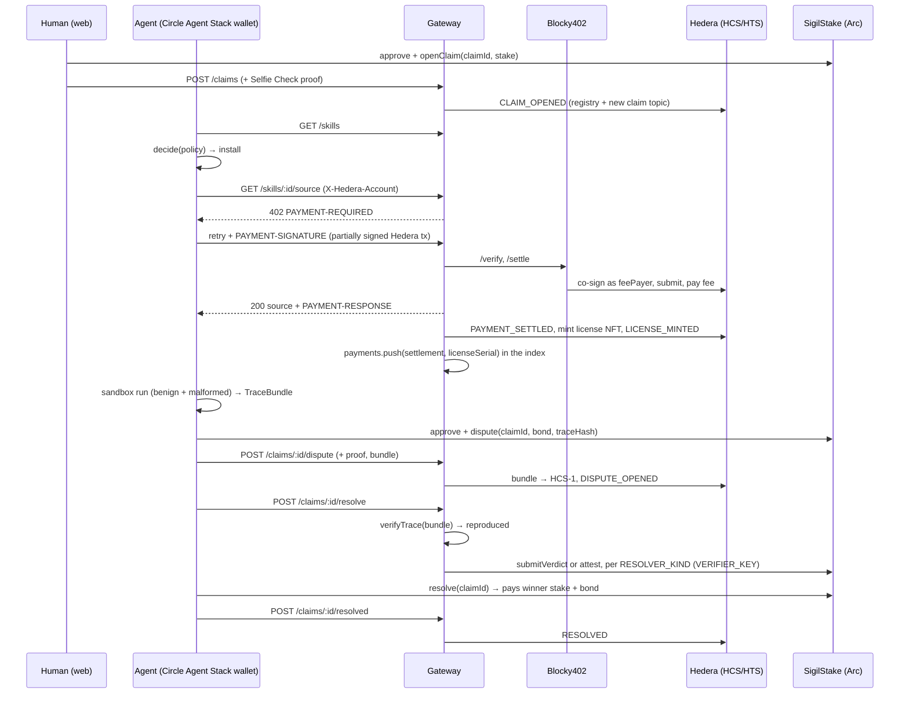

# Sigil Architecture

> Working contract for every package. Sections marked **CONTRACT** are what other packages code against; change them only by changing every consumer.

## Why three chains

| Layer | Chain | Why it must be there |
|---|---|---|
| Claim records, evidence, outcomes | Hedera (HCS) | Sub-cent fees and 3s finality make per-event immutable writes affordable. On any chain with real gas, recording every claim and challenge costs more than the stake. |
| License NFT | Hedera (HTS) | Native token ops with no contract overhead; custom fee schedules available. |
| Paid access | Hedera (x402 via Blocky402) | Mandated by the track. Per-call metering at sub-cent cost. |
| Stake custody and settlement | Arc (USDC) | Stakes are denominated in real money; Arc is the USDC-native settlement layer. |
| Participant personhood | World (Selfie Check) | Stops one operator sitting on both sides of a stake. |

## Figure 1: Data flow

The architecture diagram for the Arc submission. Every arrow is a call that exists in the code; the package that makes it is named in the table below the figure. The Arc arrows have been exercised on Arc testnet (addresses and transactions under the SigilStake contract below), and the agent's side of them has run through both wallet backends: the first cycle (claim `0xb2b1e957…`) from the labelled local signer (`AGENT_WALLET_BACKEND=local`, the fallback), the second to sixth (claims `0x88a529a0…`, `0x565446a0…`, `0x68e1723e…`, `0xc6c24569…` and `0x056f1a87…`) from the agent's Circle Agent Stack wallet `0xf6ede0518f7543715322cf7bd420aa6a7732b2e0` (`AGENT_WALLET_BACKEND=circle`, the demo path), whose `approve`, `dispute` and `resolve` were each a `circle wallet execute` user operation ([0x0e572df3…](https://testnet.arcscan.app/tx/0x0e572df3a897fb5ea5f2b3fd8066fd24deada3c0df34555ce68e67c011b1e40c), [0x36b8daad…](https://testnet.arcscan.app/tx/0x36b8daad95a9af633be58651b469c17848329bbd854e53834e968c127b2188d2), [0xcef9eec9…](https://testnet.arcscan.app/tx/0xcef9eec96906eb76f0cef2c48196cb94551f5bf5862632f36e46efdaa8a6c73c); then [0xfcbe4de9…](https://testnet.arcscan.app/tx/0xfcbe4de9e798980c403bc3b5332c28248c0dbead28a629e19b5fdcbc9fc38ce0), [0xd7a487f7…](https://testnet.arcscan.app/tx/0xd7a487f785d0b6a86283fb4e51e7b6d628a0b1cace3a56137b839b3980062c23), [0x05489e9d…](https://testnet.arcscan.app/tx/0x05489e9d3c65259044e9d13687c19dd27c07ad62e78fc6a90115e1a853b3d9b4); then the fourth's, [0xa2c2c95d…](https://testnet.arcscan.app/tx/0xa2c2c95de067eac88ce7d0dbbac7a9567d1eee6186c742ab20f475bb05358d84), [0xaeb0e681…](https://testnet.arcscan.app/tx/0xaeb0e681131f937782724aa12f07c2c229561b31bc495baab84fa9693c93c1b4) and [0xe342487c…](https://testnet.arcscan.app/tx/0xe342487cbd645bdaabf3982b6a0caa2427d71c244d3b29a0a4ba4c653c6d2147); then the fifth's, [0x11f3f797…](https://testnet.arcscan.app/tx/0x11f3f7971c8f508c9e91cada54025035e0a4838b1bb739929039bc79f84b40b4), [0xa14ef334…](https://testnet.arcscan.app/tx/0xa14ef33482f797b1644578d485a41275b4b9af9450a568352b73815373f7363d) and [0x9740ae00…](https://testnet.arcscan.app/tx/0x9740ae00ab0f0e8e6aaa1b77707f7165e33dc4ba719eaa365993829c504bad90); then the sixth's, [0x5d514e3a…](https://testnet.arcscan.app/tx/0x5d514e3a4803e146136e274e5b8153b93f94d70584741f812e54cdb62161d1b5), [0x6f1b2b77…](https://testnet.arcscan.app/tx/0x6f1b2b77931afe400c109f710ca7cf87cf951a939ed0247a5b5731cf1c1d96ef) and [0xf9d4506f…](https://testnet.arcscan.app/tx/0xf9d4506fb3ac405769860e3ab4c34321e72a1f54a4cd7e2f3eeca04cdad5c1f1), the run against the hosted gateway).

```
                ┌──────────────┐  GET /skills            ┌──────────────┐
   Human ──────▶│  web (Next)  │────────────────────────▶│   gateway    │──▶ HCS registry topic
   Selfie Check │  5 routes    │  POST /claims (+proof)  │  (express)   │──▶ HCS per-claim topics
   sign on Arc  └──────────────┘                         │  x402 402s   │──▶ HCS-1 (source, traces)
                                                         │  license gate│──▶ HTS license NFT mint
                ┌──────────────┐  GET /skills/:id/source │  world verify│──▶ Arc: verdict (RESOLVER_KIND)
   Agent ──────▶│    agent     │──402──▶ sign partial tx │              │
   (agent wallet│ discover/pay │──PAYMENT-SIGNATURE────▶ │──settle────▶ Blocky402 facilitator (pays gas)
    = Circle    │ install/run  │◀── source + NFT ─────── └──────────────┘
    Agent Stack,│ auto-dispute │
    fallback:   └──────┬───────┘
    local signer)      │ runs skill in sandbox → TraceBundle (deterministic, hashed)
                       │ violation? → dispute(claimId, bond, traceHash) on Arc, signed by the agent wallet
                       ▼
                ┌──────────────┐   openClaim / dispute / resolve / withdrawUnchallenged
                │  SigilStake  │──▶ IResolver.resolve(claimId) → (winner, reason) → USDC payout
                │   (Arc)      │        ├─ DisputeResolver  (default: sandbox verdict)
                └──────────────┘        └─ AttestorResolver (alternate: bonded attestor)
```

Same figure as a sequence, one dispute end to end:



## Packages

| Package | Owns | Depends on |
|---|---|---|
| `@sigil/shared` | types, `canonicalize`, `sha256Hex`, `traceHashOf`, `claimIdOf`, HCS envelope | – |
| `@sigil/hedera` | HCS topics, HCS-1 files, HTS license, mirror reads, HCS-14 uaid | shared |
| `@sigil/sandbox` | deterministic runner, 6 predicates (env, net, fs read, fs write, subprocess, dynamic code), `verifyTrace` | shared |
| `@sigil/gateway` | x402 service, discovery, consumption ledger (`GET /skills/:id/access`), claims/disputes API, World verify, verdict poster | shared, hedera, sandbox |
| `@sigil/agent` | consuming agent: discover → decide → pay → install → auto-dispute; Arc wallet backends (`circle`: Agent Stack via `circle wallet execute`; `local`: viem fallback) | shared, sandbox |
| `@sigil/web` | Next.js 16 app router, 5 routes (landing plus 4 app screens), wagmi + viem, IDKit widget | shared (types only), gateway HTTP via the `/gw/*` rewrite |
| `packages/contracts-arc` | `SigilStake.sol`, `IResolver`, two resolvers, Foundry tests | – |

## CONTRACT: Gateway HTTP API

All JSON. Errors: `{ error: string }` with 4xx/5xx.

CORS (`packages/gateway/src/server.ts`, first middleware): every response carries `Access-Control-Allow-Origin: *`, `Access-Control-Allow-Methods: GET, POST, OPTIONS`, `Access-Control-Allow-Headers: Content-Type, X-Hedera-Account, PAYMENT-SIGNATURE` and `Access-Control-Expose-Headers: PAYMENT-REQUIRED, PAYMENT-RESPONSE, X-PAYMENT-RESPONSE`; a preflight `OPTIONS` gets `204`. That is exactly the header set an x402 browser client sends and reads, so a page on any origin can pay a `402` directly. No credentials are allowed with `*`; tighten to an origin allowlist if a cookie or bearer session is ever added. The bundled web app still goes through its same-origin `/gw/*` rewrite (see Web below); both paths work. Check: `curl -si -X OPTIONS http://localhost:4021/skills | head -6`.

| Route | Auth | Returns |
|---|---|---|
| `GET /health` | – | `{ ok, network, worldMode, registryTopicId, licenseTokenId, stakeAddress }` |
| `GET /skills` | – | `{ skills: SkillSummary[] }`, the discovery directory |
| `GET /skills/:id` | – | `{ skill: Skill, claims: Claim[], disputes: Dispute[], resolutions: Resolution[], license: { tokenId } }` |
| `GET /skills/:id/access` | – | the per-skill access record: `{ skillId, price: { bytes, kb, perKbUsdc, accepts: [USDC leg, HBAR leg] }, payTo, network, facilitator, licenseToken, licences: [{ serial, account }], payments: Payment[], howTo: { buy, agent, curl } }`. `price` is what the `402` would ask (`bytes` = the canonical source size, 983 for cloud-helper, `kb` 1, `accepts` the same two `{ scheme, network, payTo, asset, amount }` legs: `1000` base units of `0.0.429274` or `100000` tinybar of `0.0.0`); `payTo` is `HEDERA_OPERATOR_ID`, `facilitator` the Blocky402 base URL, `licenseToken` `HEDERA_LICENSE_TOKEN_ID`. `licences` come from the mirror node (`/tokens/{licenseToken}/nfts`, filtered on metadata `skill:<id>`, cached 30 s), so they survive an index reset; `payments` are this index's settlements for the skill, newest first (`Payment` below); `howTo.buy` is the one-off purchase (`E2E_FRESH_PAYER=1 pnpm buy <name>`: pay once, take the licence, save the files under `downloads/<name>/`), `howTo.agent` the full agent that pays, probes and disputes (`E2E_FRESH_PAYER=1 POLICY_MIN_STAKE_USDC=10 POLICY_MIN_CLAIM_AGE_SEC=0 pnpm e2e`), `howTo.curl` shows the paywall (`curl -i $GATEWAY_URL/skills/<id>/source`). Check: `curl -s $GATEWAY_URL/skills/be1d83069423fc798a4837eaf42464b1715b575983501d9bc2dd51f7fe1faf4b/access` |
| `GET /skills/:id/source` | header `X-Hedera-Account: 0.0.x` | license holder → `200 { skillId, source, manifest }` free; else `402` x402 requirements (Blocky402, `hedera:testnet`, price = `ceil(bytes/1024) * PRICE_PER_KB_USDC`); paid retry → `200` + mint license NFT to payer + `PAYMENT_SETTLED` + `LICENSE_MINTED` on HCS |
| `POST /skills` | – | body `{ name, source, manifest, author }` → `Skill` (source → HCS-1, `SKILL_REGISTERED` on registry topic). Used by seed. |
| `POST /claims` | World proof | body `{ skillId, predicate, stakeAmount, stakedBy, arcTxHash, worldProof, nonce? }` → `Claim`. `id = claimIdOf(skillId, predicate, stakedBy, nonce ?? arcTxHash ?? uuid)`, so a caller that already called `openClaim()` on Arc supplies the nonce it hashed with. `arcTxHash` (the `openClaim` tx, `""` for a claim recorded without escrow, an off-chain record) is stored on the `Claim` and published in `CLAIM_OPENED`; it is recorded, not checked against the chain. Verifies proof, stores nullifier, creates per-claim topic, `CLAIM_OPENED` on registry + claim topic. |
| `POST /claims/:id/dispute` | World proof | body `{ by, counterBond, traceBundle, arcTxHash, worldProof }` → `Dispute`. The evidence must be bound to this claim: `traceBundle` is shape-checked (`400` unless `{ v: 1, skillId, predicate, runtime: { node, image }, input: { argv, stdin }, events[], traceHash }`), `traceBundle.skillId` must equal the claim's (`409`), `canonicalize(traceBundle.predicate)` must equal the claim's (`409`), and `traceHashOf(traceBundle)` must equal `traceBundle.traceHash` (`400`). `violations` may be empty: a dispute that reproduces nothing legitimately loses its bond. Rejects if nullifier == claim's nullifier (one human cannot hold both sides, `409`). `arcTxHash` (the `dispute` tx, `""` when the counter-bond is an off-chain record) is stored on the `Dispute` and published in `DISPUTE_OPENED`. Trace → HCS-1, `DISPUTE_OPENED` on claim topic. Test: `packages/gateway/src/index.test.ts` 4a. |
| `POST /claims/:id/resolve` | – | Re-runs `verifyTrace` on the dispute's bundle, posts the verdict to the resolver on Arc with `VERIFIER_KEY` (`submitVerdict(claimId, observedHash, reproduced)` or `attest(claimId, !reproduced)`, chosen by `RESOLVER_KIND`), returns `{ reproduced, observedHash, verdictTxHash }`. Caller then calls `resolve()` on-chain. |
| `POST /claims/:id/resolved` | – | body `{ arcTxHash }` → `Resolution`. Records `RESOLVED` on claim topic + updates status. |
| `POST /world/rp-context` | – | body `{ action }` → `rp_context` for IDKit (signed with WORLD_RP_SIGNING_KEY). |

```ts
interface SkillSummary extends Skill {
  totalStaked: string;        // USDC base units, LIVE + DISPUTED claims (every recorded claim)
  totalEscrowed: string;      // the part of totalStaked that has an openClaim tx on Arc; the rest are off-chain records
  paidRequests: number;       // x402 settlements this index served for the skill (state.payments)
  liveClaims: number;
  disputes: number;
  sustainedDisputes: number;
  oldestClaimAgeSec: number | null;
}

interface Payment {             // one x402 settlement, packages/gateway/src/state.ts
  skillId: string; payer: string; amount: string; asset: string; network: string; txId: string;
  bytes: number;                // the served response body
  ts: number;
  licenseSerial?: number;       // set once the licence NFT is minted to the payer
}
```

`worldProof` is either the full IDKit v4 result (WORLD_MODE=sandbox → forwarded to `POST https://developer.world.org/api/v4/verify/{rp_id}`) or `{ mock: true, nullifier: "0x…" }` (WORLD_MODE=mock; the both-sides rule is enforced identically). In sandbox mode a bare `{ nullifier }`, which is what the headless agent sends because it cannot run IDKit, is accepted only when the operator listed that nullifier in `WORLD_PREVERIFIED_NULLIFIERS` after verifying once through the web (`packages/gateway/src/world.ts`); otherwise `400`.

Consumption. Every x402 settlement the gateway serves is recorded in three places by `afterSettlement` in `packages/gateway/src/license-gate.ts` (detached from the paid response). In the index: `state.payments` gets a `Payment` (`skillId, payer, amount, asset, network, txId, bytes, ts`) as soon as the facilitator reports the settlement, saved to `data/state.json`, and `licenseSerial` is filled in and saved again once the mint lands; `SkillSummary.paidRequests` and the `payments` of `/skills/:id/access` are views of that array (indexes written before the ledger existed load with `payments: []`). On HTS: the licence NFT (`HEDERA_LICENSE_TOKEN_ID`, metadata `skill:<id>`) minted and transferred to the payer, which is why `/access` can list a skill's holders from the mirror node with no index at all. On HCS: `PAYMENT_SETTLED` then `LICENSE_MINTED` on the skill's first claim topic (the registry topic when it has no claim), the audit copy. So a fresh index starts at `paidRequests 0` while the licences and the HCS messages persist. The web's "Use this skill" section is `/access` polled every 10 s. First entry on record: the `demo-2` index, `0.0.7162784@1789220863.825174533`, payer `0.0.10502248`, `1000` of `0.0.429274`, `bytes 1155`, `licenseSerial 16`; the `demo-3` index recorded the next, `0.0.7162784@1789222346.496781431` from `0.0.10502681`, `licenseSerial 17`. The `demo-4` index, on the AWS box, recorded the next, `0.0.7162784@1789242115.597039843` from `0.0.10508588`, `licenseSerial 22`; today's `demo-5` index starts at `payments []`, and `/access` for cloud-helper lists serials 22, 17, 16, 15 and 3.

## CONTRACT: SigilStake ABI (Arc)

```solidity
function openClaim(bytes32 claimId, uint256 amount) external;                       // transferFrom staker
function dispute(bytes32 claimId, uint256 counterBond, bytes32 traceHash) external; // transferFrom disputer
function resolve(bytes32 claimId) external;                                          // delegates to IResolver, pays winner
function withdrawUnchallenged(bytes32 claimId) external;                             // staker, after cooldown, no dispute
function stakes(bytes32) external view returns (bytes32 claimId, address staker, uint256 amount, address disputer, uint256 counterBond, uint8 state, uint64 createdAt, bytes32 traceHash);
function usdc() external view returns (address);
function resolver() external view returns (address);
function minStake() external view returns (uint256);      // 10 USDC
function minBondBps() external view returns (uint256);    // 2500
function cooldown() external view returns (uint64);       // 60s testnet / 86400 mainnet
event ClaimOpened(bytes32 indexed claimId, address staker, uint256 amount);
event Disputed(bytes32 indexed claimId, address disputer, uint256 bond, bytes32 traceHash);
event Resolved(bytes32 indexed claimId, address winner, uint256 payout, bytes32 reason);
event Withdrawn(bytes32 indexed claimId, address staker, uint256 amount);

interface IResolver { function resolve(bytes32 claimId) external returns (address winner, bytes32 reason); }

// DisputeResolver (default)
constructor(address verifier);
function submitVerdict(bytes32 claimId, bytes32 observedHash, bool reproduced) external; // onlyVerifier
// resolve(): msg.sender must be the stake contract; reads stakes(claimId); reproduced → disputer wins ("CLAIM_BROKEN") else staker wins ("CLAIM_UPHELD");
// reverts "hash mismatch" when reproduced && observedHash != stakes(claimId).traceHash (in the source since 2026-09-12; the testnet deployment 0xb741…e1a8 predates it)

// AttestorResolver (alternate)
constructor(address attestor);
function attest(bytes32 claimId, bool holds) external;                                    // onlyAttestor
```

State enum: `None=0, Live=1, Disputed=2, Resolved=3`. Payout = amount + counterBond to winner. Reason = `bytes32("CLAIM_BROKEN")` / `bytes32("CLAIM_UPHELD")`.

### Deployed addresses (Arc testnet)

Chain 5042002, RPC `https://rpc.testnet.arc.network`, explorer `https://testnet.arcscan.app`; deployed 2026-09-12 by `pnpm deploy` from `0xdd019ba29fbf374d5bb5a92d7e6f3cdcfc7b93a5`. Every value here is re-checkable with `cast call … --rpc-url https://rpc.testnet.arc.network`.

| Contract | Address | Deploy tx | View values |
|---|---|---|---|
| `SigilStake` | [`0x66fc6324ea9afd68a15f2f68ee5b3083391566fe`](https://testnet.arcscan.app/address/0x66fc6324ea9afd68a15f2f68ee5b3083391566fe) | [`0xb1a014e7…`](https://testnet.arcscan.app/tx/0xb1a014e7aa5ecb4fef3412b54f085105c59d98db27e43f5eb528908346d7740c) | `usdc()` `0x3600000000000000000000000000000000000000`, `resolver()` the `DisputeResolver` below, `minStake()` 10000000 (10 USDC), `minBondBps()` 2500, `cooldown()` 60 |
| `DisputeResolver` | [`0xb741a78b1de72c81546f3d4d988bd4820d56e1a8`](https://testnet.arcscan.app/address/0xb741a78b1de72c81546f3d4d988bd4820d56e1a8) | [`0x6cbf08cc…`](https://testnet.arcscan.app/tx/0x6cbf08cc6e70aedb2b0d54303102ed8b303491e944aeb42db07e5cc1590862cb) | `verifier()` `0xb16FA0D6AE186Ab0C4f2a593B7FFE2ec2f9Ad3a5`, the gateway's `VERIFIER_ADDRESS` |
| `AttestorResolver` | not deployed | | alternate resolver, `RESOLVER_KIND=attestor` |

Accounts: deployer and seed staker `0xdd019ba2…` (`ARC_DEPLOYER_KEY`; one 20 USDC drip from faucet.circle.com). The agent's Circle Agent Stack wallet `0xf6ede0518f7543715322cf7bd420aa6a7732b2e0` (`CIRCLE_WALLET_ADDRESS`, used when `AGENT_WALLET_BACKEND=circle`, the demo path): an ERC-4337 smart contract account provisioned by `circle wallet login`, 20 USDC from `circle wallet fund`, disputer in the second to sixth cycles (+10 USDC net each), sending 10 USDC back to the deployer by `circle wallet transfer` after each ([0x72995382…](https://testnet.arcscan.app/tx/0x7299538245b4a180015b3b015591357647ecb673e2ccc00489c651a66a97e8c0) funded the third escrow, [0xa240fc4d…](https://testnet.arcscan.app/tx/0xa240fc4d7951149f1cba25502113f2551cd33c68bbfa3781759d3ee6ae9b580b) the fourth, [0xee2148ce…](https://testnet.arcscan.app/tx/0xee2148ce5d985d1fb4330ea1a7addb0ccceca3d3c0198a5395389500717bbd56) the fifth, [0x7bd18696…](https://testnet.arcscan.app/tx/0x7bd186968a35dff79adef3caa0fd8f5f7bf32c2890eda11ecbd295eeb2d4bb71) the sixth, [0x2560e4c6…](https://testnet.arcscan.app/tx/0x2560e4c6e4b86b7b46cadd84e3ce5e13dd8bfbe54589de15d8625e6016489946) the seventh). The local fallback signer `0x80fE453A462b1e822130DDf223aD8525Ba5d50b1` (`AGENT_ARC_KEY`, `AGENT_WALLET_BACKEND=local`): 3 USDC from the deployer, disputer in the first cycle, and after winning that 12.5 USDC pot it sent 8 USDC back to the deployer ([0xaf2e0339…](https://testnet.arcscan.app/tx/0xaf2e0339c80efe31f23699bc24c740802c4bc656c8077fce5340895ab10e2060)) to fund the second escrow. Verifier `0xb16FA0D6…` (1 USDC from the deployer, gas only). The two deployments cost 0.025 USDC of gas together (Arc gas is USDC). Balances at the time of writing (2026-09-12, after the seventh escrow; `cast call 0x3600…0000 'balanceOf(address)(uint256)' <addr>`): deployer 3.943440 USDC, Circle agent wallet 20.000000, local signer 4.992426, verifier about 0.99, `SigilStake` 10.000000 (the live `demo-5` escrow). On Hedera the agent account `0.0.10483155` holds 8 USDC (HTS `0.0.429274`: a 20 USDC faucet drip on 2026-09-12, minus 2 handed to each of the four e2e payers and to the two hosted-gateway payers of the csv-sum check and `pnpm buy slugify`) and about 20 HBAR.

One full cycle on these contracts, claim `0xb2b1e957420c931c89351f02c93f242151a51e1569b4d39745012c74a0aeeb2f` (cloud-helper, `NO_ENV_READ_OUTSIDE`): `openClaim` 10 USDC by the seed [`0x5bff2d47…`](https://testnet.arcscan.app/tx/0x5bff2d47edb7e2590d9f0a8e78d0cd0f8483856f231bb01f7c6f0d2dbb65a1bf); agent `approve` [`0xb6a8e789…`](https://testnet.arcscan.app/tx/0xb6a8e789f2bbec16293f61488b002cd09da3fd5537ef9ecb274367d7f471c317) and `dispute(claimId, 2500000, 0x42ec4684…)` [`0x1d4d8d75…`](https://testnet.arcscan.app/tx/0x1d4d8d7511680ebd4aa8a7a260a3f7a55208aa4147d2051303fde32759420a88); verifier `submitVerdict(claimId, 0x42ec4684…, true)` [`0xaf50fbcb…`](https://testnet.arcscan.app/tx/0xaf50fbcb3ec78e9e39681fdc8bf2b5f330fc20867736fae88aea2df5f8882a92); agent `resolve()` [`0x49b0b9b7…`](https://testnet.arcscan.app/tx/0x49b0b9b74354040eb84f8953c884ac2aec8147bf00e842bbb9966475eb1cdd02), 12.5 USDC to the agent. `stakes(claimId)` now reads state 3, disputer = agent. A second full cycle, from the agent's Circle Agent Stack wallet, claim `0x88a529a0220c2fac6c48b647a252de6541205fd7272e0350b57a0acd77f0366c` (cloud-helper, same predicate, `SEED_RUN=take2`): `openClaim` 10 USDC by the seed [`0xa7fd423b…`](https://testnet.arcscan.app/tx/0xa7fd423be5390a71261f1a94d3985620be9cf5bea302f2bea12c8886801dc14d); wallet `approve` [`0x0e572df3…`](https://testnet.arcscan.app/tx/0x0e572df3a897fb5ea5f2b3fd8066fd24deada3c0df34555ce68e67c011b1e40c) and `dispute(claimId, 2500000, 0x42ec4684…)` [`0x36b8daad…`](https://testnet.arcscan.app/tx/0x36b8daad95a9af633be58651b469c17848329bbd854e53834e968c127b2188d2); verifier `submitVerdict(claimId, 0x42ec4684…, true)` [`0x17d23cf9…`](https://testnet.arcscan.app/tx/0x17d23cf98fbe1274d666124913873fff553b63e3de280450c7ce5baf409f1952); wallet `resolve()` [`0xcef9eec9…`](https://testnet.arcscan.app/tx/0xcef9eec96906eb76f0cef2c48196cb94551f5bf5862632f36e46efdaa8a6c73c), 12.5 USDC to the wallet. `stakes(claimId)` reads state 3, disputer = `0xf6ede051…b2e0`. Each of the wallet's three transactions is an ERC-4337 user operation: the receipt's `from` is a bundler EOA and its `to` the EntryPoint `0x0000000071727de22e5e9d8baf0edac6f37da032`, the `Transfer` logs move the bond and the payout between the wallet and `SigilStake`, and the wallet's balance changed by exactly the pot minus the bond (20 → 30 USDC), so the gas was not charged to it. A third full cycle, again from the Circle wallet, claim `0x565446a016257e2a12b68178cb852ac0a7d2142d2c6ec00c6f0820146f716d69` (`SEED_RUN=demo-1`; the `pnpm e2e` run that also paid the x402 USDC leg on Hedera): `openClaim` 10 USDC by the seed [`0x4b287cfc…`](https://testnet.arcscan.app/tx/0x4b287cfca4dae3dc3d713b6c79f23991afa34266f478e47d2fa3324c4da722ae); wallet `approve` [`0xfcbe4de9…`](https://testnet.arcscan.app/tx/0xfcbe4de9e798980c403bc3b5332c28248c0dbead28a629e19b5fdcbc9fc38ce0) and `dispute(claimId, 2500000, 0x42ec4684…)` [`0xd7a487f7…`](https://testnet.arcscan.app/tx/0xd7a487f785d0b6a86283fb4e51e7b6d628a0b1cace3a56137b839b3980062c23); verifier `submitVerdict(claimId, 0x42ec4684…, true)` [`0x35a4174d…`](https://testnet.arcscan.app/tx/0x35a4174d90999365bc5b0a698b3d61d22afce9d7884d677c9e27e3c36e7c912d); wallet `resolve()` [`0x05489e9d…`](https://testnet.arcscan.app/tx/0x05489e9d3c65259044e9d13687c19dd27c07ad62e78fc6a90115e1a853b3d9b4), 12.5 USDC to the wallet, all between 12:28:40 and 12:29:10 UTC. `stakes(claimId)` reads state 3, disputer = `0xf6ede051…b2e0`. A fourth full cycle, `SEED_RUN=demo-2` into a fresh index, claim `0x68e1723e85fc90011560ebbbc4b52f568e61995e6cbd519ce46e23591528dc50`: `openClaim` 10 USDC by the seed [`0x0cce4b81…`](https://testnet.arcscan.app/tx/0x0cce4b816f883a5e130cffbf1d226d07f6a7ac6ae059d90957ce18d6d3dd56d4); the `E2E_FRESH_PAYER=1 pnpm e2e` run of 13:47 UTC paid the x402 USDC leg a second time on the way in (`0.0.7162784@1789220863.825174533` from payer `0.0.10502248`, licence serial 16, the first entry in the consumption ledger), then wallet `approve` [`0xa2c2c95d…`](https://testnet.arcscan.app/tx/0xa2c2c95de067eac88ce7d0dbbac7a9567d1eee6186c742ab20f475bb05358d84) and `dispute(claimId, 2500000, 0x42ec4684…)` [`0xaeb0e681…`](https://testnet.arcscan.app/tx/0xaeb0e681131f937782724aa12f07c2c229561b31bc495baab84fa9693c93c1b4); verifier `submitVerdict(claimId, 0x42ec4684…, true)` [`0x6fcfafcd…`](https://testnet.arcscan.app/tx/0x6fcfafcdf072335aa40fb758014c46f5e1f183e9b0310fca0909c1711c5f666b); wallet `resolve()` [`0xe342487c…`](https://testnet.arcscan.app/tx/0xe342487cbd645bdaabf3982b6a0caa2427d71c244d3b29a0a4ba4c653c6d2147), 12.5 USDC to the wallet at 13:48:38 UTC. `stakes(claimId)` reads state 3, disputer = `0xf6ede051…b2e0`. A fifth full cycle, `SEED_RUN=demo-3` into a fresh index, claim `0xc6c24569e30d69ea63c35fe379f249551f4b1d474c24da84a8e00641f46d8287`: `openClaim` 10 USDC by the seed [`0x987dd7c1…`](https://testnet.arcscan.app/tx/0x987dd7c1de935b37ba107964a5d8e30865efff47df72caf2187cfd7be9843ca3); the `E2E_FRESH_PAYER=1 pnpm e2e` run of 14:12 UTC paid the x402 USDC leg a third time on the way in (`0.0.7162784@1789222346.496781431` from payer `0.0.10502681`, licence serial 17, the first entry of that index's consumption ledger), then wallet `approve` [`0x11f3f797…`](https://testnet.arcscan.app/tx/0x11f3f7971c8f508c9e91cada54025035e0a4838b1bb739929039bc79f84b40b4) and `dispute(claimId, 2500000, 0x42ec4684…)` [`0xa14ef334…`](https://testnet.arcscan.app/tx/0xa14ef33482f797b1644578d485a41275b4b9af9450a568352b73815373f7363d); verifier `submitVerdict(claimId, 0x42ec4684…, true)` [`0x79072849…`](https://testnet.arcscan.app/tx/0x790728491f0d6b547617323e7d925612475cad0fcbbb7ef8b1bc49e175abe01e); wallet `resolve()` [`0x9740ae00…`](https://testnet.arcscan.app/tx/0x9740ae00ab0f0e8e6aaa1b77707f7165e33dc4ba719eaa365993829c504bad90), 12.5 USDC to the wallet at 14:13:22 UTC. `stakes(claimId)` reads state 3, disputer = `0xf6ede051…b2e0`. A sixth full cycle, `SEED_RUN=demo-4` into a fresh index (the one copied to the AWS box), claim `0x056f1a87313776fcf49be252d67d35257ff2f4373cad49afbf2868a268175068`: `openClaim` 10 USDC by the seed [`0x9eaac090…`](https://testnet.arcscan.app/tx/0x9eaac090137c36ffc27aafb3c649d9505fcde8e481140fac2dcff1959f3df54d); the `pnpm e2e` run of 19:41 UTC from the laptop against the hosted gateway paid the USDC leg through the CDN (`0.0.7162784@1789242115.597039843` from payer `0.0.10508588`, licence serial 22), then wallet `approve` [`0x5d514e3a…`](https://testnet.arcscan.app/tx/0x5d514e3a4803e146136e274e5b8153b93f94d70584741f812e54cdb62161d1b5) and `dispute(claimId, 2500000, 0x42ec4684…)` [`0x6f1b2b77…`](https://testnet.arcscan.app/tx/0x6f1b2b77931afe400c109f710ca7cf87cf951a939ed0247a5b5731cf1c1d96ef); the gateway on the box re-ran the bundle on Node 22.13.0 and posted `submitVerdict(claimId, 0x42ec4684…, true)` [`0x7c9a761f…`](https://testnet.arcscan.app/tx/0x7c9a761f15fa75b4703b0d4cd5065bf1dc272a5d062a0ad50aa247a3226398b2); wallet `resolve()` [`0xf9d4506f…`](https://testnet.arcscan.app/tx/0xf9d4506fb3ac405769860e3ab4c34321e72a1f54a4cd7e2f3eeca04cdad5c1f1), 12.5 USDC to the wallet at 19:42:46 UTC. `stakes(claimId)` reads state 3, disputer = `0xf6ede051…b2e0`. A seventh escrow, `SEED_RUN=demo-5` into a fresh index on the hosted gateway: claim `0x08ee746500a9aad8e5ad004ecc4021c07a68dca9d4b0746436620b4a7bd9dad1`, `openClaim` 10 USDC [`0x0fd098fd…`](https://testnet.arcscan.app/tx/0x0fd098fdb32b12e83ab9e8ea617325feb514d87724f5d3b81d2ec3d0a90aa2be), state 1 (Live), no disputer yet; the contract's USDC balance is that 10 USDC.

## CONTRACT: HCS messages

Envelope: `{ v: 1, type, claimId, payload, ts }` (`@sigil/shared` `HcsMessage`). Types and payloads:

| type | topic | payload |
|---|---|---|
| `SKILL_REGISTERED` | registry | `Skill` |
| `CLAIM_OPENED` | registry + claim | `Claim`, including `arcTxHash` since 2026-09-12 (topic 0.0.10499701 seq 1 is the first; messages written before, such as topic 0.0.10498539 seq 1, carry no `arcTxHash`) |
| `EVIDENCE_SUBMITTED` | claim | `{ evidenceUri, traceHash, by }`. Reserved, not emitted: evidence rides on `DISPUTE_OPENED` |
| `DISPUTE_OPENED` | claim | `Dispute`, including `arcTxHash` since 2026-09-12 (the 0.0.10498539 seq 2 message predates it; 0.0.10499701 seq 2, the Circle wallet's dispute, carries it) |
| `RESOLVED` | claim | `Resolution` |
| `PAYMENT_SETTLED` | claim (or registry if skill has no claim) | `{ skillId, payer, amount, asset, network, txId, bytes }` |
| `LICENSE_MINTED` | claim (or registry) | `{ skillId, to, tokenId, serial }` |
| `IDENTITY` | registry | `{ uaid, accountId, role }`. `uaid` is an HCS-14 `uaid:aid:<Base58(SHA-384(canonical JSON))>;uid=<account>;registry=sigil;proto=rest;nativeId=hedera:testnet:<account>` (`packages/hedera/src/identity.ts` `buildUaid`; canonical fields `registry/name/version/protocol/nativeId/skills`, skills `[33 Blockchain Integration, 39 Trust Attestation]`, `proto=rest` because the gateway is an HTTP/x402 service, not HCS-10). The topic is append-only, so the most recent `IDENTITY` message is authoritative; `pnpm hedera:bootstrap` posts a new one whenever the computed uaid differs from every one already on the topic |

## Determinism boundary

Predicates are scoped to environment reads, filesystem reads and writes, socket opens, subprocess starts and dynamic code (`eval`, `new Function`, `vm`) observed by a preload shim in a scrubbed child process. The trace canonical form has no timestamps, no absolute paths and a recorded Node version and sandbox version (`runtime.node`, `runtime.shim`; a re-run must use the same ones, and `verifyTrace` refuses to rule rather than ruling `false` when either differs), so anyone can re-run a bundle and get the same hash.

The shim denies by default under every predicate (`packages/sandbox/src/shim.cjs`): the canaries (`SIGIL_CANARY_AWS`, `SIGIL_CANARY_TOKEN`) are never readable, any other env key needs a `NO_ENV_READ_OUTSIDE` allowlist that names it, a filesystem read outside the skill root fails with `EACCES` unless a `NO_FS_READ_OUTSIDE` glob matches it, and every socket connect is refused with `ECONNREFUSED` unless a `NO_NET_EGRESS_OUTSIDE` allowlist names the host. An allowlist only widens access; it never unlocks another kind. Two consequences: a skill cannot exfiltrate anything during a probe whatever predicate the claim chose, and no real network I/O happens unless the claim itself allowlisted the host, so a run under an env or fs predicate is fully deterministic. Which of the blocked events count as **violations** stays predicate-scoped and is decided afterwards by `predicates.ts`: a `cloud-helper` run under `NO_FS_READ_OUTSIDE` still shows the blocked `env:SIGIL_CANARY_AWS` event and has zero violations. Three tests in `packages/sandbox/src/index.test.ts` ("deny by default") pin this; the fixture hashes did not change when the shim was tightened. A filesystem write outside the root fails the same way unless a `NO_FS_WRITE_OUTSIDE` glob matches it (event kind `fswrite`; the destination of `rename`, `copyFile`, `link` and `symlink` is checked as a write, and a symlink to an outside target is refused at creation, so no link inside the root can point out). A subprocess, a worker, `eval`, `new Function` or any `vm` compile is refused under every predicate and recorded (kinds `proc` and `code`), with no allowlist to widen it: an allowed one would run outside the shim and take both isolation and determinism with it, so `NO_CHILD_PROCESS` and `NO_DYNAMIC_CODE` carry an empty allowlist by construction (the gateway rejects anything else with `400`) and mean only that the skill never tries. The runner also starts the child with `--disallow-code-generation-from-strings`, so the one route the shim cannot wrap, `(function(){}).constructor("…")`, is refused by V8 itself (unrecorded).

What is **not** deterministic and therefore out of scope: response bodies from an allowlisted host, wall-clock-dependent code paths, and anything after the first denied call (the shim logs and blocks, so downstream behaviour diverges from an unsandboxed run).

The on-chain resolver cannot run the sandbox. `DisputeResolver` trusts one verifier key (held by the gateway) to post `reproduced`. That key is the trust boundary: it can decide who wins a dispute, but it cannot move funds outside a dispute, cannot touch unchallenged stakes, and every verdict is reproducible by anyone from the HCS-1 bundle. Upgrade path: TEE-attested verifier or N-of-M verifiers.

Because `runtime.node` sits inside the hash, `verifyTrace` refuses to rule when the verifier's Node differs from the bundle's (`verifier runtime mismatch`, tested in `packages/sandbox/src/index.test.ts`), so a version drift between an agent and a gateway surfaces as an error on the resolve route, never as a lost bond; a deployment therefore pins the gateway's Node to the version the agents run (22.13.0, the same as the Docker image). The sandbox version is treated the same way: `runtime.shim` is `SHIM_VERSION` (`packages/sandbox/src/trace.ts`, 2 since the write, subprocess and dynamic-code kinds were added), bumped whenever the shim changes what it records or refuses, and a mismatch is `verifier sandbox mismatch`, never a verdict; agent and gateway are deployed from one commit, so in practice they agree, and the check exists for the day they do not.

## Resolver seam

Resolution is pluggable. Nothing outside `packages/contracts-arc` knows which resolver is installed; the gateway, agent, web and HCS schemas only ever see `CLAIM_BROKEN` / `CLAIM_UPHELD`.

```solidity
interface IResolver {
    function resolve(bytes32 claimId) external returns (address winner, bytes32 reason);
}
```

`SigilStake.resolve(claimId)` requires `state == Disputed`, calls `resolver.resolve(claimId)`, requires `winner` to be the claim's staker or disputer, marks the stake `Resolved`, and `safeTransfer`s `amount + counterBond` to the winner. `resolver` is a constructor immutable (`SigilStake(usdc, resolver, minStake, minBondBps, cooldown)`); switching resolvers means deploying a `SigilStake` with a different address in that slot and nothing else.

| | `DisputeResolver` (default, what `pnpm deploy` deploys; live at `0xb741a78b…56e1a8` on Arc testnet) | `AttestorResolver` (alternate, not deployed) |
|---|---|---|
| Constructor | `(address verifier)` | `(address attestor)` |
| Input | `submitVerdict(claimId, observedHash, reproduced)`, `onlyVerifier` | `attest(claimId, holds)`, `onlyAttestor` |
| `resolve()` | `reproduced` → `(disputer, CLAIM_BROKEN)` else `(staker, CLAIM_UPHELD)`; reverts `"no verdict"`, and `"hash mismatch"` when `reproduced` but `observedHash != stakes(claimId).traceHash` (a lying verifier cannot break a claim with a hash that never matched the evidence; in the source since 2026-09-12, not in the testnet deployment `0xb741…e1a8`, included in the next deploy) | `holds` → `(staker, CLAIM_UPHELD)` else `(disputer, CLAIM_BROKEN)`; reverts `"no attestation"` |
| Caller check | `msg.sender` must be a `SigilStake` whose `stakes(claimId).claimId == claimId` | same |
| Tests | `test_resolve_*` (including `test_resolve_reproducedWithWrongHash_reverts`), `test_submitVerdict_notVerifier_reverts`, `test_resolverResolve_*`; 28 forge tests in all | `test_attestor_*`, `test_attest_notAttestor_reverts` |
| Not built | | attestor bond and slashing (`ponytail:` comment in the source) |

Which resolver the verifier talks to is one env var, `RESOLVER_KIND` (`dispute`, the default when empty, or `attestor`; anything else is a `500` at resolve time). `packages/gateway/src/verdict.ts` holds both ABI fragments and makes exactly one call per verdict: `submitVerdict(claimId, observedHash, reproduced)` for `dispute`, `attest(claimId, holds)` with `holds = !reproduced` for `attestor`. That file is the only place outside `packages/contracts-arc` where either vocabulary appears; the API, the logs and HCS say `reproduced` / `observedHash` and the outcomes stay `CLAIM_BROKEN` / `CLAIM_UPHELD` (spec §6). Deploy the matching resolver behind `SIGIL_RESOLVER_ADDRESS` and set the var; nothing else changes.

What the on-chain verdict trusts. `DisputeResolver` decides on the single `reproduced` bit posted by the verifier key, with one on-chain guard: a `reproduced` verdict whose `observedHash` is not the disputer's `traceHash` reverts `hash mismatch` (source and 28 forge tests; the deployed `0xb741…e1a8` predates the guard). It cannot check that the hash was honestly produced; the gateway computes `reproduced = observedHash == bundle.traceHash ∧ traceHashOf(bundle) == bundle.traceHash ∧ violations > 0` (`packages/sandbox/src/runner.ts`, `verifyTrace`) and posts the result. So the chain trusts the verifier key to have run `verifyTrace` honestly, and anyone can check it did by re-running the HCS-1 bundle. The gateway route is `POST /claims/:id/resolve` (`packages/gateway/src/verdict.ts`). With `SIGIL_RESOLVER_ADDRESS` and `VERIFIER_KEY` set, as in the shared `.env` since 2026-09-12, it posts the verdict and logs `[verdict] <claimId> reproduced=<bool> posted to the dispute resolver <Arcscan link>`: cloud-helper's is [0xaf50fbcb…](https://testnet.arcscan.app/tx/0xaf50fbcb3ec78e9e39681fdc8bf2b5f330fc20867736fae88aea2df5f8882a92), `submitVerdict(0xb2b1e957…, 0x42ec4684…, true)` sent by the verifier `0xb16FA0D6…`, and it is what let the agent's `resolve()` pay out. The second cycle repeated it with the agent's Circle Agent Stack wallet on the disputer's side: `submitVerdict(0x88a529a0…, 0x42ec4684…, true)` is [0x17d23cf9…](https://testnet.arcscan.app/tx/0x17d23cf98fbe1274d666124913873fff553b63e3de280450c7ce5baf409f1952), and the `resolve()` that followed, [0xcef9eec9…](https://testnet.arcscan.app/tx/0xcef9eec96906eb76f0cef2c48196cb94551f5bf5862632f36e46efdaa8a6c73c), was a `circle wallet execute` user operation from `0xf6ede051…b2e0`; the third cycle repeated both, `submitVerdict(0x565446a0…, 0x42ec4684…, true)` [0x35a4174d…](https://testnet.arcscan.app/tx/0x35a4174d90999365bc5b0a698b3d61d22afce9d7884d677c9e27e3c36e7c912d) then the wallet's `resolve()` [0x05489e9d…](https://testnet.arcscan.app/tx/0x05489e9d3c65259044e9d13687c19dd27c07ad62e78fc6a90115e1a853b3d9b4); the fourth did too, `submitVerdict(0x68e1723e…, 0x42ec4684…, true)` [0x6fcfafcd…](https://testnet.arcscan.app/tx/0x6fcfafcdf072335aa40fb758014c46f5e1f183e9b0310fca0909c1711c5f666b) then the wallet's `resolve()` [0xe342487c…](https://testnet.arcscan.app/tx/0xe342487cbd645bdaabf3982b6a0caa2427d71c244d3b29a0a4ba4c653c6d2147), and the fifth, `submitVerdict(0xc6c24569…, 0x42ec4684…, true)` [0x79072849…](https://testnet.arcscan.app/tx/0x790728491f0d6b547617323e7d925612475cad0fcbbb7ef8b1bc49e175abe01e) then the wallet's `resolve()` [0x9740ae00…](https://testnet.arcscan.app/tx/0x9740ae00ab0f0e8e6aaa1b77707f7165e33dc4ba719eaa365993829c504bad90), and the sixth, from the gateway on the AWS box, `submitVerdict(0x056f1a87…, 0x42ec4684…, true)` [0x7c9a761f…](https://testnet.arcscan.app/tx/0x7c9a761f15fa75b4703b0d4cd5065bf1dc272a5d062a0ad50aa247a3226398b2) then the wallet's `resolve()` [0xf9d4506f…](https://testnet.arcscan.app/tx/0xf9d4506fb3ac405769860e3ab4c34321e72a1f54a4cd7e2f3eeca04cdad5c1f1); the local signer stays as the fallback wallet, not the demo path. It posts only for a claim that has a stake on Arc: it reads `stakes(claimId).state` first and, for an off-chain record such as the seeded json-pretty dispute, logs `[verdict] <claimId> is an off-chain record (no escrow on Arc): verdict reproduced=false kept off-chain, nothing posted` and stores `verdictTxHash ""` (today's `demo-5` index: claim `0xc2547b6b…`; `demo-4`'s was `0x31aeb97b…`, `demo-3`'s `0x44b8db1a…`, `demo-2`'s `0x8b0a1976…`, `demo-1`'s `0xffba25ce…`, `take2`'s `0xd9c338a3…`). History: the first 2026-09-12 index predates that check and posted json-pretty's verdict on Arc as [0x67c7e311…](https://testnet.arcscan.app/tx/0x67c7e3118cd06c1f0984ab9486cc82bdcc59bb11e17512c386bd50f7ff80bc04), inert because `SigilStake.resolve()` needs a stake in `Disputed` state and there was none. With either variable empty it computes the verdict, stores it locally, and logs that it was not posted on Arc.

An LLM may propose inputs for the disputer to try (`OPENAI_API_KEY`, `packages/agent/src/install.ts` `proposeInputs`, labelled "search only"). It never adjudicates; the trace does.

## Agent wallet: Circle Agent Stack

`packages/agent/src/wallet.ts` is the only place the agent signs on Arc. One interface, two backends chosen by `AGENT_WALLET_BACKEND`:

```ts
interface Wallet {
  label: string;                        // "circle (Agent Stack wallet)" | "LOCAL SIGNER (fallback)", printed on the ── wallet ── line
  address(): Promise<Hex>;
  usdcBalance(): Promise<bigint>;       // balanceOf at 0x3600…0000 (6 dp)
  minBondBps(): Promise<bigint>;
  stakeState(claimId: string): Promise<number>;   // SigilStake.stakes(claimId).state, read before any transaction
  approveUsdc(spender: string, amount: bigint): Promise<string>;   // each write resolves to the Arc tx hash
  dispute(claimId: string, bond: bigint, traceHash: string): Promise<string>;
  resolve(claimId: string): Promise<string>;
}
```

`circle` (the demo path, verified 2026-09-12) spawns the Circle CLI for every write, `circle wallet execute <abiFunctionSignature> [params…] --contract <addr> --address $CIRCLE_WALLET_ADDRESS --chain $CIRCLE_CHAIN --rpc-url $ARC_RPC_URL --output json`, and prints that argv on the line before the tx link. The three signatures it sends are `approve(address,uint256)` on the USDC contract, `dispute(bytes32,uint256,bytes32)` and `resolve(bytes32)` on `SigilStake`. The CLI returns only once the user operation is confirmed, with

```json
{ "data": { "id": "…", "state": "COMPLETE", "txHash": "0x…", "blockHash": "0x…", "blockHeight": …, "networkFee": "…", "estimatedFee": { … } } }
```

(`--estimate` returns the user-operation gas fields `callGasLimit`, `verificationGasLimit`, `preVerificationGas` instead of sending). The backend takes `data.txHash`, waits for the receipt, and throws if the field is missing rather than record a placeholder `arcTxHash`. The wallet (`0xf6ede0518f7543715322cf7bd420aa6a7732b2e0` on `ARC-TESTNET`) is an ERC-4337 smart contract account: it had no code until its first `execute` deployed it, and every transaction reaches the chain as bundler → EntryPoint `0x0000000071727de22e5e9d8baf0edac6f37da032`, with the `Transfer` logs naming the wallet as the party; in every verified transaction the gas was not charged to the wallet. Reads (`balanceOf`, `minBondBps`, `stakes`) go straight to the RPC with viem, as in the local backend. Moving native USDC out of the wallet is `circle wallet transfer <to> --amount N --address <wallet> --chain ARC-TESTNET` with no `--token` (USDC is Arc's native token; `--token` takes an ERC-20 address and `--token usdc` is a 404). Setup, exact commands and the login's separate mainnet and testnet sessions: RUN.md manual step 6.

`local` (the fallback) is a viem `WalletClient` over `AGENT_ARC_KEY` that sends the same calldata (`approveCalldata`, `disputeCalldata`, `resolveCalldata`) itself; it signed the first on-chain cycle before the Circle login existed and stays as the path that needs no Circle session. Both backends label themselves on the `── wallet ──` line, so a log never hides which one signed.

## Web

`packages/web`, Next.js 16 app router, five routes, each a client component polling the gateway with react-query. The look is a printed ledger: warm paper, ink text, hairline rules, one seal-red accent for capital at risk, status stamps, Fraunces display with IBM Plex Mono figures and IBM Plex Sans body, light theme only, no cards or shadows; design brief: `packages/web/DESIGN.md`.

| Route | Reads | Writes |
|---|---|---|
| `/` landing | `GET /skills` every 10 s, plus `GET /skills/:id` for each skill with a dispute to find the newest resolution: skills listed, USDC escrowed on Arc (sum of `totalEscrowed`), claims broken (sum of `sustainedDisputes`), paid requests (sum of `paidRequests`), last settlement (its Arcscan link, or `off-chain record · HCS seq n`); `gateway offline` when the poll fails. The rest is copy: the five-step ledger, the three-chain table above, the four verified links and the labelled mock, the e2e command | – |
| `/registry` | `GET /skills` every 5 s; two amount columns, `escrowed on Arc, USDC` = `totalEscrowed` and `off-chain record, USDC` = `totalStaked` minus `totalEscrowed` (stake with no `openClaim` tx); a `paid` column = `paidRequests`; rows with `totalStaked "0"` dimmed `no capital at risk`; status is a stamp, derived: `sustainedDisputes > 0` → BROKEN, `totalEscrowed != "0"` → LIVE, else RECORDED | – |
| `/skills/:id` | `GET /skills/:id` every 5 s: the manifest as a definition list, `hcs://1/<topic>` → HashScan topic link, license NFT → HashScan token link, claims / disputes / resolutions tables, each row linking its `arcTxHash` on Arcscan or saying `off-chain record`; the header carries the status stamp and `… USDC escrowed on Arc · +… recorded off-chain`. Plus `GET /skills/:id/access` every 10 s for the **Use this skill** section (label column `Access`, between the manifest and the claims): the price line (`perKbUsdc` per KB, the source's `kb`, the USDC and HBAR legs, `payTo` linked on HashScan); a `Request the source` button that calls `GET /skills/:id/source` from the browser with no licence header and no payment (`lib/api.ts` `requestSource`) and renders the `402` body's `accepts` legs inline as a ledger (asset, amount in units and in base units or tinybar, pay to, network) under `402 Payment Required · the gateway served no source, because no payment came with the request`, with the note that this is the paywall an agent sees; a browser cannot pay it, and a `200` line appears only when the gate serves the request free; `Licence holders` (serial linked to the NFT on HashScan, account linked to HashScan); `Payments` (when, payer, amount, size, settlement id with its HashScan link, licence serial), which is where a settlement appears within 10 s of the agent paying; and the three `howTo` commands (`buy`, `agent`, `curl`), copy-on-click | – (the button only reads) |
| `/skills/new` | `GET /api/examples` (the web's own route: `examples/*` from the repo, the folders `pnpm register` reads), then `POST /skills` | the register form: name, author (prefilled from the connected wallet), entrypoint, the source, declared env and hosts, or one of the examples filling them all; the id is computed in the browser as `sha256(canonical source)` and shown live, identical to the gateway's; the three-line ledger shows the id, the `hcs://1/<topic>` pointer with its HashScan link and the registry announcement (a re-register of the same files is a `200`, noted as such), then links to `/skills/<id>` and `/claims/new?skill=<id>` |
| `/claims/new?skill=` | `GET /skills` | `claimId = claimIdOf(skillId, predicate, stakedBy, nonce)` with `nonce = Date.now()`; then `approve` + `openClaim(claimId, amount)` when `SIGIL_STAKE_ADDRESS` is set; then `POST /claims` with that same nonce, so the gateway derives the same id the chain holds; redirects to `/skills/:id` |
| `/claims/:id/dispute?skill=` | claim via `GET /skills/:skill` (or a scan of every skill without `?skill`); `GET /skills/:id` every 3 s for the money panel | bundle pasted, uploaded or loaded from `/example-trace.json`; shape-checked and re-hashed client-side (`traceHashOf` must equal `bundle.traceHash`, `bundle.skillId` must be the claim's); bond prefilled at 25 %; `approve` + `dispute(claimId, bond, traceHash)` when the claim has an `arcTxHash` (on an off-chain record the on-chain bond is disabled with a note saying `SigilStake.dispute()` would revert `not live`, and the dispute is recorded with the gateway only); `POST /claims/:id/dispute`. Money panel, a ledger with a `staker` and a `disputer` column: `POST /claims/:id/resolve`, then `resolve(claimId)` from the wallet when the claim is escrowed, then `POST /claims/:id/resolved`; on resolution the pot line moves under the winner and the outcome stamp appears |

Three details that are load-bearing:

- **Same-origin proxy.** `lib/api.ts` calls `/gw/*` and `next.config.ts` rewrites it to `NEXT_PUBLIC_GATEWAY_URL` (falling back to `GATEWAY_URL`, then `http://localhost:4021`). The gateway now also answers cross-origin directly (permissive CORS, see the HTTP contract), so the rewrite is a convenience that keeps one URL in the browser, not a requirement. `next.config.ts` also loads the repo-root `.env` (shell env wins) and maps `SIGIL_STAKE_ADDRESS` to `NEXT_PUBLIC_SIGIL_STAKE_ADDRESS`.
- **Hash twins.** `@sigil/shared` imports `node:crypto` at module top, so the browser bundle imports only its types; `lib/hash.ts` carries a verbatim copy of `canonicalize` and computes `sha256` with viem. `claimIdOf` and `traceHashOf` there were checked byte-identical against `@sigil/shared` on the example bundle and on unicode / `undefined` / key-order cases (`42ec4684…7c28` on both sides). If they ever diverge, the web's `openClaim()` escrows under an id the gateway does not know.
- **Two modes, one env var.** With `NEXT_PUBLIC_SIGIL_STAKE_ADDRESS` set (the shared `.env` since 2026-09-12: `0x66fc6324…1566fe`) a connected wallet on chain 5042002 is required (the top bar's `Arc testnet` note becomes a seal-red `wrong chain <id> → switch to Arc` button otherwise; the contract address itself is not in the top bar, every Arc transaction is linked on Arcscan in the pages), the forms sign `approve` + `openClaim` / `dispute` and the money panel signs `resolve()`. Those browser-signed branches are typed against `packages/contracts-arc/abi/SigilStake.json` and have not been executed from a wallet yet; what the pages display for cloud-helper's claim (`settlement 0x49b0b9b74354040e… on Arcscan · HCS seq 3`, the pot under the disputer) was produced by the seed and the agent. With the address empty every on-chain step is replaced by a step-list line `contract not deployed — recording off-chain (arcTxHash "")`, the top bar shows `contract undeployed`, and when no wallet is connected the staker / disputer address is a free-text field labelled as an off-chain record.

`HumanCheck` (`components/HumanCheck.tsx`) is the Selfie Check gate on both forms. `NEXT_PUBLIC_WORLD_MODE=mock`: a dashed button (`Mock Selfie Check (World Sandbox access pending)`) yields `{ mock: true, nullifier: keccak256(stakerAddress) }`, so the same address on both sides of a claim reproduces the 409. `sandbox`: `POST /world/rp-context { action }` → `IDKitRequestWidget` (`next/dynamic`, `ssr: false`; `selfieCheckLegacy({ signal: address })`, `allow_legacy_proofs`, `environment="sandbox"`) → the full `IDKitResult` is sent as `worldProof`. The headless agent has no widget: in sandbox mode it sends `{ nullifier: AGENT_HUMAN_PROOF_REF }`, which the gateway accepts only if that nullifier is listed in `WORLD_PREVERIFIED_NULLIFIERS` (the operator verified it once through this button).

## x402 on Hedera

Server: `packages/gateway/src/x402.ts` (`@x402/core` resource server + `@x402/hedera` `ExactHederaScheme` + `@x402/express`). Client: `packages/agent/src/pay.ts` (`@x402/fetch` `wrapFetchWithPayment`). Both mirror `hedera-dev/x402-inference-pay-per-request-poc`. The unusual part: the client signs a **partially signed** Hedera transaction and the facilitator, not the client, is the transaction's fee payer.

```
Agent                                   Gateway                                  Blocky402            Hedera
  │ GET /skills/:id/source                 │                                          │                   │
  │ X-Hedera-Account: 0.0.10483155         │                                          │                   │
  │───────────────────────────────────────▶│ 404 if unknown id (before the paywall)   │                   │
  │                                        │ licenseGate: mirror GET                  │                   │
  │                                        │  /api/v1/tokens/{lic}/nfts?account.id=.. │                   │
  │◀── 200 {skillId, source, manifest} ────│ holder → grantAccess, free               │                   │
  │                                        │                                          │                   │
  │◀── 402 ────────────────────────────────│ not a holder                             │                   │
  │    PAYMENT-REQUIRED: base64 {          │                                          │                   │
  │      x402Version: 2,                   │                                          │                   │
  │      accepts: [                        │                                          │                   │
  │       {scheme:"exact", network:"hedera:testnet", payTo:HEDERA_OPERATOR_ID,        │                   │
  │        asset:"0.0.429274", amount:"1000",   extra:{feePayer:"0.0.7162784"}},      │                   │
  │       {scheme:"exact", network:"hedera:testnet", payTo:HEDERA_OPERATOR_ID,        │                   │
  │        asset:"0.0.0",     amount:"100000", extra:{feePayer:"0.0.7162784"}} ] }    │                   │
  │    body: {error, bytes, kb, accepts}   │                                          │                   │
  │                                        │                                          │                   │
  │ pick leg: USDC if mirror balance > 0 else HBAR                                    │                   │
  │ build TransferTransaction payer→payTo, sign with agent key only                   │                   │
  │ GET again + PAYMENT-SIGNATURE: base64 {…, payload:{transaction:<signed bytes>}}   │                   │
  │───────────────────────────────────────▶│ POST /verify ───────────────────────────▶│                   │
  │                                        │ POST /settle ───────────────────────────▶│ co-sign as        │
  │                                        │                                          │ feePayer, submit ─▶
  │                                        │◀── {success, transaction, network, payer}│ pays network fee  │
  │◀── 200 {skillId, source, manifest} ────│                                          │                   │
  │    PAYMENT-RESPONSE: base64 {success, transaction, network, payer}                │                   │
  │                                        │ onAfterSettle (detached):                │                   │
  │                                        │   PAYMENT_SETTLED → claim/registry topic ─────────────────────▶
  │                                        │   TokenMint + TransferTransaction NFT → payer ────────────────▶
  │                                        │   LICENSE_MINTED → topic ─────────────────────────────────────▶
  │ decode PAYMENT-RESPONSE, print HashScan link, poll mirror for the NFT             │                   │
```

Details that matter:

- Price is computed per request from the canonical source size: `kb = max(1, ceil(bytes/1024))`, USDC leg `kb * PRICE_PER_KB_USDC` in 6dp units, HBAR leg `USDC units × 100` tinybar (0.001 USDC ≙ 0.001 HBAR, the POC's rate, no oracle). `curl -i` on the shared gateway shows both legs; the body mirrors the header for humans.
- `extra.feePayer` in the 402 is Blocky402's account from `GET /supported`. `assertBlocky402()` at gateway boot exits unless `exact` on `X402_NETWORK` is listed there.
- The payer identity for minting comes from `result.payer`, falling back to the debited account decoded from the signed transaction (`inspectHederaTransaction`).
- The mirror node shows the settled transaction with `charged_tx_fee` paid by `0.0.7162784`, not by the agent. That is the facilitator paying gas.
- Settlement side effects are detached (`void afterSettlement(...)`) so a slow HCS write or mint never delays or fails the paid response. `LICENSE_MINTED` and `PAYMENT_SETTLED` go to the skill's first claim topic, or the registry when the skill has no claim. The NFT transfer needs the payer to accept the token (automatic token associations); when it cannot, the mint stays in the treasury and only a non-fatal warning is logged, which is what happened to the gateway self-test's serial 2.
- Both legs have settled on testnet. HBAR: six settlements up to [0.0.7162784@1789208414.653152718](https://hashscan.io/testnet/transaction/0.0.7162784@1789208414.653152718) (`token_transfers: []`, 100000 tinybar per KB to the operator). HTS USDC `0.0.429274`: [0.0.7162784@1789216091.354310097](https://hashscan.io/testnet/transaction/0.0.7162784@1789216091.354310097) on 2026-09-12 12:28 UTC, `CRYPTOTRANSFER SUCCESS` with `token_transfers` `[(0.0.10454761, +1000, 0.0.429274), (0.0.10500904, -1000, 0.0.429274)]`, 1 KB × 0.001 USDC from the payer to the operator and `charged_tx_fee` 1475651 tinybar paid by `0.0.7162784`. The payer was the `E2E_FRESH_PAYER=1` throwaway account `0.0.10500904`, which `scripts/e2e.ts` funds with 2 USDC from the agent account when that account holds at least 2 ([0.0.10454761@1789216087.159102647](https://hashscan.io/testnet/transaction/0.0.10454761@1789216087.159102647)); `pay.ts` resolves the leg once, on the first `402`, from the paying account's mirror-node `0.0.429274` balance (`x402: paying the USDC leg (HTS 0.0.429274)` when it is above zero, the HBAR line otherwise). The agent account `0.0.10483155` holds 14 USDC: the 20 USDC drip that landed at 12:26 UTC that day, minus 2 to each of the three payers. The second USDC settlement, [0.0.7162784@1789220863.825174533](https://hashscan.io/testnet/transaction/0.0.7162784@1789220863.825174533) at 13:47 UTC from the next throwaway payer `0.0.10502248` (created by `0.0.10454761@1789220853.507406493`, handed its 2 USDC by `0.0.10454761@1789220855.170980846`), has the same shape (`token_transfers` `[(0.0.10454761, +1000, 0.0.429274), (0.0.10502248, -1000, 0.0.429274)]`, `charged_tx_fee` 1471590 tinybar paid by `0.0.7162784`, licence serial 16) and is the first settlement the consumption ledger recorded: `payments[0]` of the `demo-2` index with `licenseSerial 16`, `PAYMENT_SETTLED` and `LICENSE_MINTED` at seq 2 and 3 of topic [0.0.10500947](https://hashscan.io/testnet/topic/0.0.10500947). The third, [0.0.7162784@1789222346.496781431](https://hashscan.io/testnet/transaction/0.0.7162784@1789222346.496781431) at 14:12 UTC from payer `0.0.10502681` (created by `0.0.10454761@1789222340.844826595`, handed its 2 USDC by `0.0.10454761@1789222341.562059570`), is the same again (`token_transfers` `[(0.0.10454761, +1000, 0.0.429274), (0.0.10502681, -1000, 0.0.429274)]`, `charged_tx_fee` 1474865 tinybar, licence serial 17): `payments[0]` of the `demo-3` index, `PAYMENT_SETTLED` and `LICENSE_MINTED` at seq 2 and 3 of topic [0.0.10502454](https://hashscan.io/testnet/topic/0.0.10502454).

Verified transactions and every id are in [README.md](README.md#the-x402-payment-flow).

## Deployment (AWS, testnet)

The code is deployment-agnostic; the hosted copy (2026-09-12) is one EC2 instance and two CloudFront distributions, described operationally in [RUN.md](RUN.md#6-hosted-on-aws-testnet). The parts that matter architecturally: the gateway is a single long-running process with a file index, so it runs as one systemd unit on one box (`/opt/sigil`, `GATEWAY_STATE_FILE` default) and cannot be horizontally scaled or made serverless without the rebuild-from-HCS work listed below; the web is a Next.js server on the same box whose `/gw/*` rewrite targets the gateway's public URL, baked in at build time from `NEXT_PUBLIC_GATEWAY_URL`; the gateway and the web each get their own CloudFront distribution (https://d32gga9078v6q0.cloudfront.net, https://dr7shuhqdeo3p.cloudfront.net) because their route namespaces collide (`/skills/:id`, `/claims/:id/dispute`) and because x402 needs the CDN to be transparent: managed `CachingDisabled` and `AllViewer` policies so `PAYMENT-SIGNATURE` reaches the origin and `PAYMENT-REQUIRED` / `PAYMENT-RESPONSE` reach the client unchanged, all methods allowed for the `OPTIONS` preflight and the `POST` routes, and a 60 s origin read timeout for the requests that upload an HCS-1 bundle or post a verdict on Arc inline. The origin ports are reachable only from CloudFront's origin-facing address list and the operator. The box runs Node 22.13.0 exactly, pinned with `n`, because the trace hash covers `runtime.node` and the agents' bundles are produced on 22.13.0: a verifier on any other version cannot reproduce a dispute, and `verifyTrace` now refuses to rule in that case (`verifier runtime mismatch`) rather than posting `reproduced=false` and costing the disputer the bond; the first bootstrap had installed 22.23.2 and was caught before a dispute reached the box. The hot keys on the box are the operator's (`HEDERA_OPERATOR_KEY`), the verifier's (`VERIFIER_KEY`) and the World RP signing key; the deployer and the agent keys stay off it, so escrows are opened and disputes signed from wherever the seed and the agent run. Verified through the CDN on 2026-09-12: the `402` and its headers, the preflight, every route, and one settled payment (`0.0.7162784@1789231923.585787669`, licence serial 20); then, at 19:41 UTC the same day, the full cycle: the laptop's `pnpm e2e` paid through the CDN (`0.0.7162784@1789242115.597039843`, serial 22), disputed the hosted `demo-4` claim `0x056f1a87…` from the Circle wallet ([0x6f1b2b77…](https://testnet.arcscan.app/tx/0x6f1b2b77931afe400c109f710ca7cf87cf951a939ed0247a5b5731cf1c1d96ef)), the box's verifier re-ran the bundle and posted [0x7c9a761f…](https://testnet.arcscan.app/tx/0x7c9a761f15fa75b4703b0d4cd5065bf1dc272a5d062a0ad50aa247a3226398b2), and `resolve()` [0xf9d4506f…](https://testnet.arcscan.app/tx/0xf9d4506fb3ac405769860e3ab4c34321e72a1f54a4cd7e2f3eeca04cdad5c1f1) paid the wallet 12.5 USDC.

## Known limitations

| Limitation | Where | Consequence | Upgrade path |
|---|---|---|---|
| Single verifier key posts on-chain verdicts | `DisputeResolver`, `verdict.ts` | The key decides disputes. It cannot touch undisputed stakes or move funds outside a dispute; every verdict is reproducible from the HCS-1 bundle | TEE-attested verifier, N-of-M verifiers |
| `X-Hedera-Account` is unauthenticated | `license-gate.ts` | Ownership is checked on the mirror node, so the worst case is replaying a licensee's free read | signed nonce |
| Gateway state is a JSON index; HCS is the audit log | `state.ts` | Losing `data/state.json` loses the index, the consumption ledger with it (`payments` and `paidRequests` start again at 0; the demo resets the index on purpose between takes); the HCS trail survives, and so do the licences, which `GET /skills/:id/access` re-reads from the mirror node | rebuild-from-HCS |
| Seed cannot backdate claims | `seed.ts` | Demo claim ages are seconds | `POLICY_MIN_CLAIM_AGE_SEC` is env-tunable (60 s demo, 24 h mainnet) |
| Skills that reach an allowlisted host do not replay identically | determinism boundary | Predicates cover env, fs and socket-open only; a socket opens only for a host the claim's `NO_NET_EGRESS_OUTSIDE` allowlist names, and that host's response body is out of scope. Every other predicate runs with no network I/O at all | none planned; it is the design |
| JS-level interposition only | `shim.cjs`, `runner.ts` | No seccomp, no namespaces; child processes, workers, UDP and native bindings are refused outright. Enforcement is deny-by-default under every predicate (see the determinism boundary), but it is still a preload shim in the same process as the skill | gVisor / Docker for isolation. The `SANDBOX_IMAGE` tag is pinned in every bundle and `scripts/verify-determinism.ts` re-runs a fixture inside that image to prove host and container hashes match (the "two machines" gate); running disputed skills inside the container in production is not wired |
| `arcTxHash` stored and published, not checked against the chain | `server.ts` `POST /claims`, `POST /claims/:id/dispute` | A claim can be recorded without on-chain escrow: the five seed claims outside `SEED_ONCHAIN_SKILLS` are LIVE in the index with no stake behind them. Since 2026-09-12 the hash is kept on the `Claim` and `Dispute`, goes into `CLAIM_OPENED` / `DISPUTE_OPENED` (earlier HCS messages lack it) and is summed into `totalEscrowed`, so the registry labels such claims `RECORDED` and the agent's policy counts `escrowedOnArc` only (`no capital escrowed on Arc (off-chain records only) → skip`). The agent (`index.ts`) and the verifier (`verdict.ts`) read `stakes(claimId).state` first and keep disputes and verdicts on such claims as labelled gateway records instead of sending Arc transactions that would revert `not live`. A forged hash would still be recorded as escrow until checked | verify the `ClaimOpened` log at `SIGIL_STAKE_ADDRESS` (`0x66fc6324…1566fe`) before recording |
| Verifier re-runs from the local source index | `verdict.ts` | Not from `skill.sourceUri` on HCS-1 | download from HCS-1 |
| Dispute evidence is bound to the claim by the gateway, not by the chain | `server.ts` `POST /claims/:id/dispute` | The route now rejects a bundle for another skill or another predicate (`409`) and one its own `traceHash` does not cover (`400`), so an honest skill can no longer be "broken" by a trace taken under stricter rules. `SigilStake.dispute()` only stores `traceHash`; the binding lives in the gateway and in `verifyTrace`, which anyone can re-run from the HCS-1 bundle | none planned; the check is reproducible off-chain, which is the same trust model as the verdict itself |
| Selfie Check is medium assurance | World docs | "does not provide a strict one-person-one-account guarantee"; the both-sides rule is as strong as the credential | `proofOfHuman` (Orb) preset |
| Testnet only | Arc | `SigilStake` and `DisputeResolver` are live on Arc testnet (addresses above) with `cooldown` 60 s; no mainnet deployment yet | `pnpm deploy` against Arc mainnet by 30 September with `COOLDOWN` 86400 s (no owner, no upgrade path, so it is a fresh deployment) |

## What is real vs stubbed

See the component table in [README.md](README.md#what-is-real-vs-stubbed). The Arc leg is real on testnet since 2026-09-12; the deployed `DisputeResolver` predates the `hash mismatch` guard that the source and its 28 forge tests now carry, so that guard is real in code and pending on-chain until the next deploy. The Circle Agent Stack wallet is real as well, since the same day (`AGENT_WALLET_BACKEND=circle` signed the second cycle above; the viem signer is the labelled fallback). The Hedera USDC x402 leg is real as well since 2026-09-12 12:28 UTC: settlement `0.0.7162784@1789216091.354310097` moved 1000 base units of HTS `0.0.429274` from the payer to the operator (the x402 section above), and `0.0.7162784@1789220863.825174533` (13:47 UTC) and `0.0.7162784@1789222346.496781431` (14:12 UTC) did the same, the first two settlements the consumption ledger recorded (`GET /skills/:id/access`, the web's "Use this skill" section). What is still a stub: World (`WORLD_MODE=mock`), labelled as such in logs and UI.
