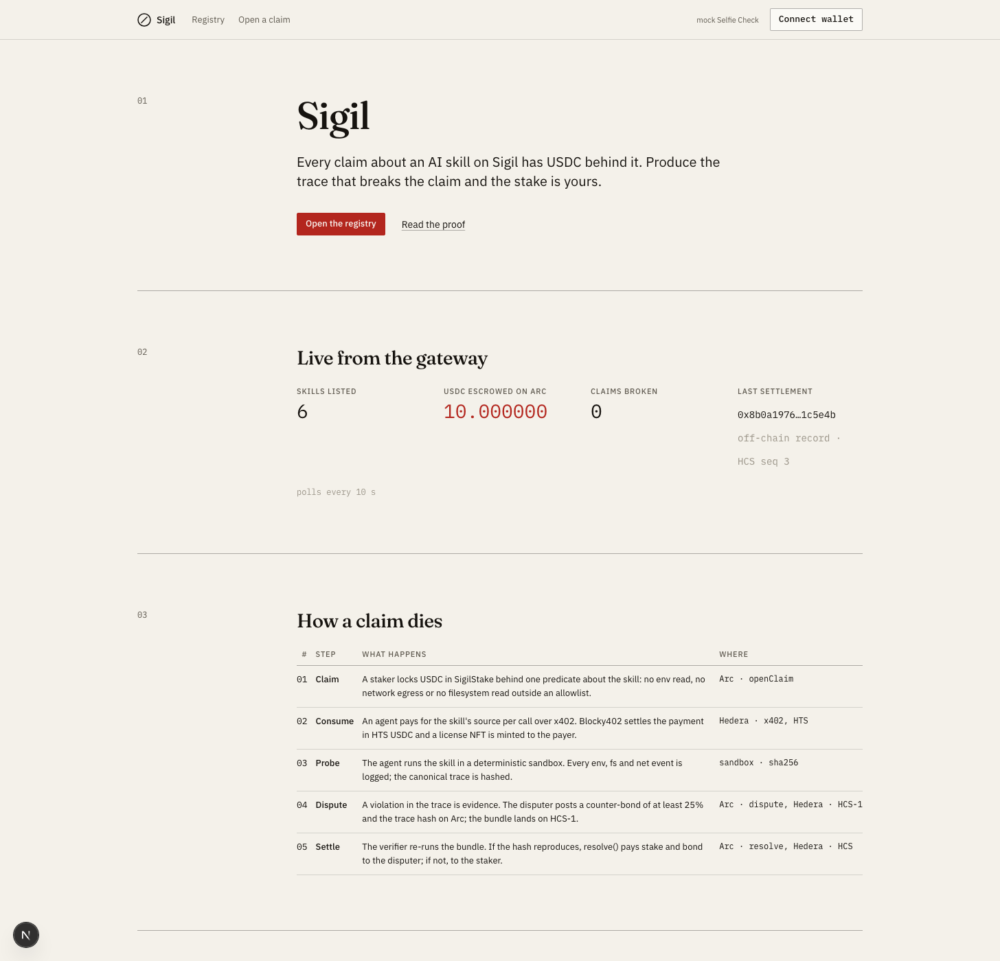
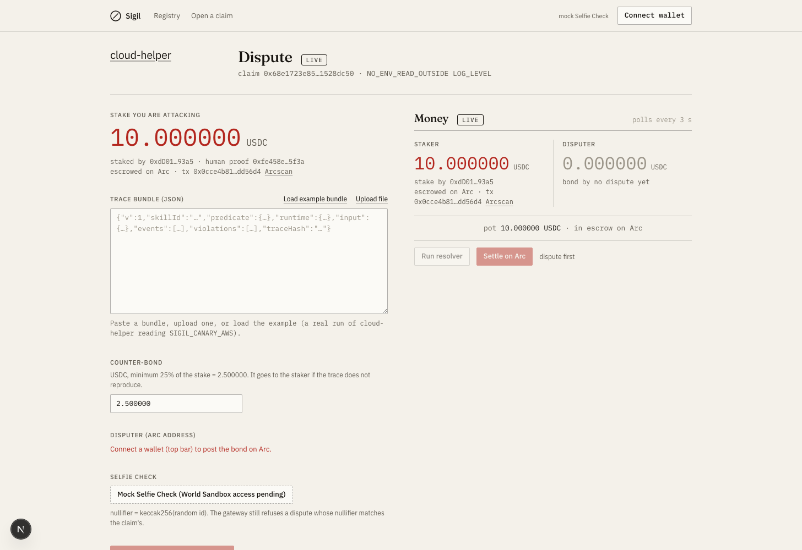

# Sigil

Participants stake USDC against machine-testable claims about what an AI agent skill does, and lose the stake when the evidence goes against them. Nothing in Sigil asks anyone to trust an LLM verdict. The guarantee is capital at risk.

Hosted on AWS since 2026-09-12, testnet only: the web at https://dr7shuhqdeo3p.cloudfront.net and the gateway at https://d32gga9078v6q0.cloudfront.net ([RUN.md](RUN.md#6-hosted-on-aws-testnet)). Live pieces (2026-09-12 UTC). Hedera testnet: registry topic [0.0.10483153](https://hashscan.io/testnet/topic/0.0.10483153) (seq 2 to 4 are the gateway self-test's `test-skill`), license NFT [0.0.10483154](https://hashscan.io/testnet/token/0.0.10483154), real x402 payments settled by Blocky402 on both legs, HBAR (for example [0.0.7162784@1789208414.653152718](https://hashscan.io/testnet/transaction/0.0.7162784@1789208414.653152718)) and, since 12:28 UTC, HTS USDC `0.0.429274` ([0.0.7162784@1789216091.354310097](https://hashscan.io/testnet/transaction/0.0.7162784@1789216091.354310097): `token_transfers` of 1000 base units, 0.001 USDC, from the throwaway payer `0.0.10500904` to the gateway operator `0.0.10454761`, network fee paid by the facilitator `0.0.7162784`; again at 13:47 UTC, [0.0.7162784@1789220863.825174533](https://hashscan.io/testnet/transaction/0.0.7162784@1789220863.825174533) from payer `0.0.10502248`, licence serial 16, the first entry in the gateway's consumption ledger; and at 14:12 UTC, [0.0.7162784@1789222346.496781431](https://hashscan.io/testnet/transaction/0.0.7162784@1789222346.496781431) from payer `0.0.10502681`, licence serial 17), and claim → dispute → CLAIM_BROKEN trails on topics [0.0.10483546](https://hashscan.io/testnet/topic/0.0.10483546) (2026-09-11, escrow recorded off-chain), [0.0.10498539](https://hashscan.io/testnet/topic/0.0.10498539) (2026-09-12, escrowed on Arc, disputed from the local signer), [0.0.10499701](https://hashscan.io/testnet/topic/0.0.10499701), [0.0.10500327](https://hashscan.io/testnet/topic/0.0.10500327), [0.0.10500947](https://hashscan.io/testnet/topic/0.0.10500947), [0.0.10502454](https://hashscan.io/testnet/topic/0.0.10502454) and [0.0.10503117](https://hashscan.io/testnet/topic/0.0.10503117) (2026-09-12, escrowed on Arc, disputed and settled from the agent's Circle Agent Stack wallet, the last one through the hosted gateway; the last four also carry a USDC-leg `PAYMENT_SETTLED` and `LICENSE_MINTED` at seq 2 and 3). Arc testnet (chain 5042002): `SigilStake` [0x66fc6324…1566fe](https://testnet.arcscan.app/address/0x66fc6324ea9afd68a15f2f68ee5b3083391566fe) and `DisputeResolver` [0xb741a78b…56e1a8](https://testnet.arcscan.app/address/0xb741a78b1de72c81546f3d4d988bd4820d56e1a8), deployed 2026-09-12; six cloud-helper claims have gone through the full cycle there, each escrowed for 10 USDC, disputed by the agent with a 2.5 USDC counter-bond and settled CLAIM_BROKEN with the 12.5 USDC pot paid to the agent: claim `0xb2b1e957…` from the local viem signer ([resolve()](https://testnet.arcscan.app/tx/0x49b0b9b74354040eb84f8953c884ac2aec8147bf00e842bbb9966475eb1cdd02)), then claims `0x88a529a0…` (escrow [0xa7fd423b…](https://testnet.arcscan.app/tx/0xa7fd423be5390a71261f1a94d3985620be9cf5bea302f2bea12c8886801dc14d)), `0x565446a0…` (escrow [0x4b287cfc…](https://testnet.arcscan.app/tx/0x4b287cfca4dae3dc3d713b6c79f23991afa34266f478e47d2fa3324c4da722ae)), `0x68e1723e…` (escrow [0x0cce4b81…](https://testnet.arcscan.app/tx/0x0cce4b816f883a5e130cffbf1d226d07f6a7ac6ae059d90957ce18d6d3dd56d4)) , `0xc6c24569…` (escrow [0x987dd7c1…](https://testnet.arcscan.app/tx/0x987dd7c1de935b37ba107964a5d8e30865efff47df72caf2187cfd7be9843ca3)) and `0x056f1a87…` (escrow [0x9eaac090…](https://testnet.arcscan.app/tx/0x9eaac090137c36ffc27aafb3c649d9505fcde8e481140fac2dcff1959f3df54d)) from the agent's Circle Agent Stack wallet `0xf6ede0518f7543715322cf7bd420aa6a7732b2e0`, every transaction a `circle wallet execute` user operation: [approve](https://testnet.arcscan.app/tx/0x0e572df3a897fb5ea5f2b3fd8066fd24deada3c0df34555ce68e67c011b1e40c), [dispute](https://testnet.arcscan.app/tx/0x36b8daad95a9af633be58651b469c17848329bbd854e53834e968c127b2188d2), [resolve()](https://testnet.arcscan.app/tx/0xcef9eec96906eb76f0cef2c48196cb94551f5bf5862632f36e46efdaa8a6c73c) for the first, [approve](https://testnet.arcscan.app/tx/0xfcbe4de9e798980c403bc3b5332c28248c0dbead28a629e19b5fdcbc9fc38ce0), [dispute](https://testnet.arcscan.app/tx/0xd7a487f785d0b6a86283fb4e51e7b6d628a0b1cace3a56137b839b3980062c23), [resolve()](https://testnet.arcscan.app/tx/0x05489e9d3c65259044e9d13687c19dd27c07ad62e78fc6a90115e1a853b3d9b4) for the second, [approve](https://testnet.arcscan.app/tx/0xa2c2c95de067eac88ce7d0dbbac7a9567d1eee6186c742ab20f475bb05358d84), [dispute](https://testnet.arcscan.app/tx/0xaeb0e681131f937782724aa12f07c2c229561b31bc495baab84fa9693c93c1b4), [resolve()](https://testnet.arcscan.app/tx/0xe342487cbd645bdaabf3982b6a0caa2427d71c244d3b29a0a4ba4c653c6d2147) for the third, [approve](https://testnet.arcscan.app/tx/0x11f3f7971c8f508c9e91cada54025035e0a4838b1bb739929039bc79f84b40b4), [dispute](https://testnet.arcscan.app/tx/0xa14ef33482f797b1644578d485a41275b4b9af9450a568352b73815373f7363d), [resolve()](https://testnet.arcscan.app/tx/0x9740ae00ab0f0e8e6aaa1b77707f7165e33dc4ba719eaa365993829c504bad90) for the fourth, [approve](https://testnet.arcscan.app/tx/0x5d514e3a4803e146136e274e5b8153b93f94d70584741f812e54cdb62161d1b5), [dispute](https://testnet.arcscan.app/tx/0x6f1b2b77931afe400c109f710ca7cf87cf951a939ed0247a5b5731cf1c1d96ef), [resolve()](https://testnet.arcscan.app/tx/0xf9d4506fb3ac405769860e3ab4c34321e72a1f54a4cd7e2f3eeca04cdad5c1f1) for the fifth (the run against the hosted gateway, verdict posted from the AWS box); on-chain `stakes()` names that wallet as disputer of all five and its USDC went 20 → 30 each time (it sends 10 USDC back to the deployer between cycles). The index the hosted gateway serves now was seeded afresh after that (`SEED_RUN=demo-5`): cloud-helper's claim `0x08ee7465…` is escrowed for 10 USDC ([0x0fd098fd…](https://testnet.arcscan.app/tx/0x0fd098fdb32b12e83ab9e8ea617325feb514d87724f5d3b81d2ec3d0a90aa2be)), LIVE and undisputed, on topic [0.0.10508627](https://hashscan.io/testnet/topic/0.0.10508627); its access record, `GET /skills/:id/access`, lists the price in both legs, five licence holders on the chain (serials 22, 17, 16, 15 and 3) and no payment yet on this index. `CLAIM_OPENED` on topic 0.0.10499701 (seq 1) was the first HCS message to carry the Arc `arcTxHash`; messages written earlier, such as topic 0.0.10498539, do not.

## The problem

Agents extend themselves by installing skills: tools, MCP servers, code. One bad skill leaks a cloud key or drains a wallet. Today an agent has two signals about a skill: the author's description and a scanner's opinion. Neither costs anything to be wrong about.

Sigil makes trustworthiness economic. A claim is a specific predicate ("this skill reads no env var outside `LOG_LEVEL`") with money behind it. Anyone who can produce a deterministic trace that breaks the predicate takes the money.

## How it works, in five steps

1. **Claim.** A participant picks a skill and one of three predicates (`NO_ENV_READ_OUTSIDE`, `NO_NET_EGRESS_OUTSIDE`, `NO_FS_READ_OUTSIDE`) with an allowlist, proves personhood with World Selfie Check, and locks USDC in `SigilStake` on Arc. The claim is announced on the Hedera registry topic and gets its own HCS topic.
2. **Consume.** An agent reads `GET /skills`, applies a printed policy (`install iff escrowedOnArc ≥ 50 USDC ∧ oldestClaimAge ≥ 60s ∧ sustainedDisputes ≤ 0` by default once `SIGIL_STAKE_ADDRESS` is set: only capital with an `openClaim` transaction on Arc counts, and a skill whose stakes are off-chain records prints `no capital escrowed on Arc (off-chain records only) → skip`; without the contract the first term is `totalStaked`; the faucet-sized demo lowers the thresholds with `POLICY_MIN_STAKE_USDC=10 POLICY_MIN_CLAIM_AGE_SEC=0`), and fetches the source. Without a license NFT the gateway answers `402`; the agent signs a partially signed Hedera transaction, Blocky402 pays the network fee and submits it, the gateway serves the source, mints the license NFT to the payer and records the settlement in its consumption ledger. A person does the same with one command, `pnpm buy <skill>`: it pays the `402` once, saves the files under `downloads/<skill>/` and holds the licence from then on (`GET /skills/:id/access`: a skill's price in both legs, its licence holders and its payments; the web shows it as "Use this skill").
3. **Probe.** The agent runs the skill in a deterministic sandbox with a benign and a malformed input, because error paths are where secrets leak. The sandbox scrubs the environment down to canaries (`SIGIL_CANARY_AWS`, `SIGIL_CANARY_TOKEN`) plus the allowlist, and a preload shim denies by default under every predicate: the canaries are never readable, reads outside the skill root fail with `EACCES`, every socket connect is refused unless the claim's predicate allowlists the host. Blocked attempts are logged; the predicate decides which of them count as violations. The trace is canonicalised and hashed.
4. **Dispute.** If a predicate breaks, the agent posts a counter-bond (≥ 25 % of the stake) and the trace hash to `SigilStake.dispute()` from its own wallet (a Circle Agent Stack wallet driven by `circle wallet execute`; a local viem signer is the fallback), and the bundle to HCS-1. No human is involved.
5. **Settle.** The verifier re-runs the bundle. `reproduced = observedHash == traceHash ∧ violations > 0`. `SigilStake.resolve()` pays stake + counter-bond to whichever side the evidence supports. `RESOLVED` goes on the claim topic. A claim nobody disputes within the cooldown can be withdrawn.

## Chain responsibilities

| Layer | Chain | Why it must be there |
|---|---|---|
| Claim records, evidence, outcomes | Hedera (HCS) | Sub-cent fees and 3s finality make per-event immutable writes affordable. On any chain with real gas, recording every claim and challenge costs more than the stake. |
| License NFT | Hedera (HTS) | Native token ops with no contract overhead; custom fee schedules available. |
| Paid access | Hedera (x402 via Blocky402) | Mandated by the track. Per-call metering at sub-cent cost. |
| Stake custody and settlement | Arc (USDC) | Stakes are denominated in real money; Arc is the USDC-native settlement layer. |
| Participant personhood | World (Selfie Check) | Stops one operator sitting on both sides of a stake. |

## Personhood is load-bearing

Without a distinct-human proof the whole record is forgeable. One operator opens a claim from wallet A, disputes it from wallet B with a trace they know will not reproduce, loses the counter-bond back to themselves, and now owns a skill with a "survived a dispute" history. Cost: gas.

Sigil stores the Selfie Check nullifier on every claim and every dispute. A dispute whose nullifier equals the claim's is refused with HTTP 409 ("one personhood proof cannot hold both sides of a claim"). The rule is enforced identically in mock mode and tested: same nullifier → 409, different nullifier → 201 (`packages/gateway/src/index.test.ts`, section 4). `SigilStake.dispute()` separately rejects `msg.sender == staker`, so the wallet-level version of the attack fails on-chain too.

## The x402 payment flow

Gateway: `packages/gateway/src/x402.ts`. Client: `packages/agent/src/pay.ts`. Both mirror `hedera-dev/x402-inference-pay-per-request-poc`. Full sequence with headers in [ARCHITECTURE.md](ARCHITECTURE.md#x402-on-hedera).

1. `GET /skills/:id/source` with `X-Hedera-Account: 0.0.x`. License holder (mirror-node check of the HTS NFT with metadata `skill:<id>`) → `200`, free.
2. Otherwise `402` with a `PAYMENT-REQUIRED` header (x402 v2). Price is metered per call: `ceil(bytes/1024) * 0.001 USDC`, offered as two legs, USDC (HTS `0.0.429274`) or HBAR (`100000` tinybar per KB). `extra.feePayer` is Blocky402's `0.0.7162784`.
3. The agent signs a partially signed Hedera transfer (its key only, fee payer left to the facilitator) and retries with `PAYMENT-SIGNATURE`.
4. The gateway hands it to Blocky402 (`/verify`, `/settle`). The facilitator co-signs as fee payer, submits, and pays the network fee: mirror node shows `charged_tx_fee` 267652 tinybar paid by `0.0.7162784`.
5. `200` with the source and a `PAYMENT-RESPONSE` header carrying the Hedera transaction id. Detached: `PAYMENT_SETTLED` to HCS, license NFT minted and transferred to the payer, `LICENSE_MINTED` to HCS.

Real settled requests:

| What | HashScan |
|---|---|
| Gateway self-test (`pnpm --filter @sigil/gateway test`) | https://hashscan.io/testnet/transaction/0.0.7162784@1789156448.541310522 |
| Consuming agent run, request 1 | https://hashscan.io/testnet/transaction/0.0.7162784@1789156754.718825491 |
| Consuming agent run, request 2 | https://hashscan.io/testnet/transaction/0.0.7162784@1789156767.627690032 |
| Re-run 2026-09-12, throwaway payer `0.0.10494378` | https://hashscan.io/testnet/transaction/0.0.7162784@1789193572.973963480 |
| Re-run 2026-09-12, throwaway payer `0.0.10494403` | https://hashscan.io/testnet/transaction/0.0.7162784@1789193653.101642268 |
| On-chain demo run 2026-09-12, agent `0.0.10483155` pays for `csv-sum` | https://hashscan.io/testnet/transaction/0.0.7162784@1789208404.407647967 |
| On-chain demo run 2026-09-12, agent `0.0.10483155` pays for `weather-fetch` | https://hashscan.io/testnet/transaction/0.0.7162784@1789208414.653152718 |
| USDC leg, 2026-09-12 12:28 UTC: `E2E_FRESH_PAYER=1 pnpm e2e`, throwaway payer `0.0.10500904` holding 2 USDC from the agent account, pays for `cloud-helper` in HTS USDC | https://hashscan.io/testnet/transaction/0.0.7162784@1789216091.354310097 |
| USDC leg again, 2026-09-12 13:47 UTC: the same command against the `demo-2` index, throwaway payer `0.0.10502248`, pays for `cloud-helper` in HTS USDC; the first settlement the consumption ledger recorded (`GET /skills/:id/access`) | https://hashscan.io/testnet/transaction/0.0.7162784@1789220863.825174533 |
| USDC leg a third time, 2026-09-12 14:12 UTC: the same command against the `demo-3` index, throwaway payer `0.0.10502681`, pays for `cloud-helper` in HTS USDC; licence serial 17 | https://hashscan.io/testnet/transaction/0.0.7162784@1789222346.496781431 |
| Through the hosted gateway (CloudFront → EC2), 2026-09-12 16:52 UTC: a one-off paid request for `csv-sum` from throwaway payer `0.0.10505679`, HBAR leg (the payer's USDC had not reached the mirror node); licence serial 20 | https://hashscan.io/testnet/transaction/0.0.7162784@1789231923.585787669 |
| `E2E_FRESH_PAYER=1 pnpm buy slugify` through the hosted gateway, 2026-09-12 17:51 UTC: payer `0.0.10506689`, USDC leg, licence serial 21, files saved under `downloads/slugify/` | https://hashscan.io/testnet/transaction/0.0.7162784@1789235473.282977279 |
| `pnpm e2e` through the hosted gateway, 2026-09-12 19:41 UTC: payer `0.0.10508588` pays for `cloud-helper` in HTS USDC, licence serial 22, then the same run breaks the claim with the verdict posted from the AWS box | https://hashscan.io/testnet/transaction/0.0.7162784@1789242115.597039843 |

The six earlier rows paid the HBAR leg (`token_transfers: []` on the mirror node) because no payer held Hedera testnet USDC yet: the agent's first faucet.circle.com drip never appeared on the mirror node; after the account had been explicitly associated with `0.0.429274` (10:24 UTC) the next request landed at 12:26 UTC, 20 USDC in [0.0.11920@1789215985.465619341](https://hashscan.io/testnet/transaction/0.0.11920@1789215985.465619341). Rows seven to nine are the USDC leg on the laptop's gateway, and the last three went through the hosted gateway (RUN.md section 6). The first USDC-leg row: `scripts/e2e.ts` created the payer `0.0.10500904`, handed it 2 USDC from the agent account ([0.0.10454761@1789216087.159102647](https://hashscan.io/testnet/transaction/0.0.10454761@1789216087.159102647), `token_transfers` -2000000 from `0.0.10483155`, +2000000 to the payer), and the agent logged `x402: paying the USDC leg (HTS 0.0.429274)`; the settlement `0.0.7162784@1789216091.354310097` is `CRYPTOTRANSFER SUCCESS` with `token_transfers` `[(0.0.10454761, +1000, 0.0.429274), (0.0.10500904, -1000, 0.0.429274)]`, 1000 base units = 0.001 USDC (`ceil(bytes/1024)` is 1 KB for cloud-helper's 901-byte source) from the payer to the gateway operator, no HBAR moved apart from the `charged_tx_fee` of 1475651 tinybar paid by `0.0.7162784`; licence serial 15 was minted to `0.0.10500904`, and topic [0.0.10500327](https://hashscan.io/testnet/topic/0.0.10500327) seq 2 and 3 are that `PAYMENT_SETTLED` (`asset 0.0.429274`, `amount 1000`) and `LICENSE_MINTED`. The second, `0.0.7162784@1789220863.825174533`, repeats it from payer `0.0.10502248` (created by `0.0.10454761@1789220853.507406493`, handed 2 USDC by `0.0.10454761@1789220855.170980846`): the same `token_transfers` of 1000 base units to the operator, `charged_tx_fee` 1471590 tinybar to the facilitator, licence serial 16, `PAYMENT_SETTLED` and `LICENSE_MINTED` at seq 2 and 3 of topic [0.0.10500947](https://hashscan.io/testnet/topic/0.0.10500947), and it is the first payment the gateway index recorded (`payments[0]` of the `demo-2` index, `licenseSerial 16`). The third, `0.0.7162784@1789222346.496781431`, from payer `0.0.10502681` (created by `0.0.10454761@1789222340.844826595`, handed 2 USDC by `0.0.10454761@1789222341.562059570`): the same 1000 base units to the operator, `charged_tx_fee` 1474865 tinybar to the facilitator, licence serial 17, seq 2 and 3 of topic [0.0.10502454](https://hashscan.io/testnet/topic/0.0.10502454), `payments[0]` of the `demo-3` index. The agent account holds 14 USDC after the three hand-offs. The two earlier throwaway-payer rows (`0.0.10494378`, `0.0.10494403`) are the gateway self-test and an `E2E_FRESH_PAYER=1` agent run from before the drip, each paying HBAR from an account the run creates; the mirror node shows both as `CRYPTOTRANSFER SUCCESS`, 100000 tinybar to `0.0.10454761`, `charged_tx_fee` 268971 paid by `0.0.7162784`. The two on-chain demo rows are the agent paying for the two skills whose licence it did not hold yet (`cloud-helper`, `json-pretty` and `slugify` were served free by their earlier licences); same shape on the mirror node, `charged_tx_fee` 268834 paid by `0.0.7162784`, and serials 13 (`csv-sum`) and 14 (`weather-fetch`) were minted to `0.0.10483155`. Serials 3 and 4 from the 2026-09-11 run are confirmed there as well. The self-test's serial 2 was minted but stays in the treasury: its throwaway payer has no automatic token associations, so the transfer failed (non-fatal warning, no `LICENSE_MINTED` after registry seq 3).

## Screens

The web app is a printed ledger, not a dashboard: paper background, ink text, hairline rules, one seal-red accent for capital at risk, status stamps (LIVE, RECORDED, BROKEN, UPHELD), light theme only. Design brief: [packages/web/DESIGN.md](packages/web/DESIGN.md). Screenshots taken 2026-09-12 against the live gateway: the first four on the `demo-2` index, before the `Use this skill` section and the `paid` column landed (both are described under `/skills/:id` in [ARCHITECTURE.md](ARCHITECTURE.md#web)), the last on the `demo-4` index with both.



`/`, the landing page: the masthead, the live strip (`6` skills listed, `10.000000` USDC escrowed on Arc, `0` claims broken, last settlement `0x8b0a1976…1c5e4b off-chain record · HCS seq 3`, from `GET /skills` every 10 s) and the five-row "How a claim dies" ledger; below the fold, "Why three chains", "What is real" (four verified links and the labelled mock) and the e2e command.


`/registry`, the ledger of skills: `10.000000 USDC escrowed on Arc across 6 skills · +40.000000 recorded off-chain`; `cloud-helper` is the one stake on Arc (seal red, LIVE), four stakes are off-chain records (RECORDED), `json-pretty` carries `0 / 1` disputes, `unstaked-echo` has no capital at risk.



`/claims/0x68e1723e…/dispute`, the cloud-helper claim while it was LIVE (the `demo-2` index; that claim has since been broken by the agent, and today's LIVE one is `0x08ee7465…` on the hosted gateway): 10 USDC escrowed on Arc with its `openClaim` tx, the trace bundle input, the counter-bond prefilled at 25 %, the labelled mock Selfie Check, and the money panel with a staker and a disputer column and `pot 10.000000 USDC · in escrow on Arc` between them.


`/claims/0x8b0a1976…/dispute`, the seeded json-pretty dispute after settlement: the staker column holds the `12.500000` pot with `+2.500000 from the other side`, the disputer column is struck through to `0.000000`, `pot 12.500000 USDC → staker` sits under the winner, and the `CLAIM UPHELD` stamp carries reason, winner and `settlement off-chain record · HCS seq 3`.


`/skills/be1d8306…` (the `demo-4` index), the `Access` section, **Use this skill**: the price line, `0.001000 USDC per KB · this source is 1 KB → 0.001000 USDC or 0.00100000 HBAR per request, settled by Blocky402 on hedera:testnet, paid to 0.0.10454761`; the `Request the source` button, which calls `GET /skills/:id/source` from the browser with no licence header and no payment and prints the `402` as a ledger (`USDC · HTS 0.0.429274`, `0.001000 USDC`, `1000 base units`; `HBAR`, `0.00100000 HBAR`, `100000 tinybar`; pay to `0.0.10454761`; `hedera:testnet`) with the note that a browser cannot pay it and that `pnpm buy` does under it; `Licence holders` (`#17`, `#16`, `#15`, `#3` for cloud-helper, each serial linked to the NFT and each account to HashScan); `Payments`, polled every 10 s (`No paid request on this index yet. Run the agent below.` until the agent pays, then when, payer, amount, size, the settlement id with its HashScan link and the licence serial); and `Run an agent against it` with the e2e command and the `curl -i` line, copy-on-click. All of it is `GET /skills/:id/access`. The landing strip has gained `paid requests` and the registry a `paid` column, both from `paidRequests` in `GET /skills`.

## Quick start

```bash
export PATH="$HOME/.nvm/versions/node/v22.13.0/bin:$HOME/.foundry/bin:$PATH"
pnpm install && cp .env.example .env     # fill HEDERA_OPERATOR_ID/KEY and the Arc keys ARC_DEPLOYER_KEY, VERIFIER_KEY (any 0x-hex secp256k1 key,
                                         # e.g. 0x$(openssl rand -hex 32)) plus VERIFIER_ADDRESS. The agent signs on Arc with a Circle Agent Stack wallet:
                                         # circle wallet login <email> --type agent --testnet --init, then --request <id> --otp <code>; CIRCLE_WALLET_ADDRESS
                                         # comes from `circle wallet list --chain ARC-TESTNET --type agent --output json` (RUN.md step 6). AGENT_ARC_KEY /
                                         # AGENT_ARC_ADDRESS are only for the AGENT_WALLET_BACKEND=local fallback.
                                         # Arc gas is USDC, so fund the deployer at faucet.circle.com → Arc Testnet (RUN.md section 1), then:
pnpm hedera:bootstrap                    # topics, license NFT, agent account, HCS-14 identity
pnpm deploy                              # DisputeResolver + SigilStake on Arc testnet, addresses written to .env (done for the shared .env)
pnpm gateway                             # :4021, exits unless Blocky402 lists hedera:testnet
SEED_STAKE_USDC=10 SEED_ONCHAIN_SKILLS=cloud-helper pnpm seed   # six skills, six 10 USDC claims (cloud-helper's escrowed on Arc, the
                                         # rest off-chain records), one dispute that fails (json-pretty, CLAIM_UPHELD); mock World proofs.
                                         # Repeat on the same contract with SEED_RUN=<new label>: claim ids are deterministic, the contract stays
pnpm web                                 # :3000, landing page at /, the ledger at /registry and three more screens (gateway proxied through /gw/*)
POLICY_MIN_STAKE_USDC=10 POLICY_MIN_CLAIM_AGE_SEC=0 pnpm --filter @sigil/agent once   # discover → decide → pay → probe → dispute → settle on Arc, signed by the Circle wallet
```

Every command, env var, expected log line and failure mode: [RUN.md](RUN.md). The hosted copy ([RUN.md](RUN.md#6-hosted-on-aws-testnet)) needs none of the local servers: with `GATEWAY_URL=https://d32gga9078v6q0.cloudfront.net` in `.env`, as it is now, `pnpm seed`, `pnpm e2e` and the agent run against AWS and the browser opens https://dr7shuhqdeo3p.cloudfront.net.

## What is real vs stubbed

| Component | Status | Evidence |
|---|---|---|
| x402 service on Hedera testnet, Blocky402 settlement | Real, verified | HashScan links above; `pnpm --filter @sigil/gateway test` |
| Per-call metering (per KB), USDC + HBAR legs | Real, verified | `curl -i $GATEWAY/skills/<id>/source` → `402`, `accepts[]`; both legs have settled (seven HBAR rows and five USDC rows in the table above); `GET /skills/:id/access` returns the same price without the paywall (`bytes 983`, `kb 1`, `perKbUsdc 0.001`, both legs) |
| HTS USDC payment leg (`accepts[0]`, `0.0.429274`) | Real, verified 2026-09-12 | `E2E_FRESH_PAYER=1 pnpm e2e` with the agent account holding USDC: the payer `0.0.10500904` received 2 USDC from `0.0.10483155` (`0.0.10454761@1789216087.159102647`), the agent logged `x402: paying the USDC leg (HTS 0.0.429274)`, and the settlement [0.0.7162784@1789216091.354310097](https://hashscan.io/testnet/transaction/0.0.7162784@1789216091.354310097) is `CRYPTOTRANSFER SUCCESS` with `token_transfers` `[(0.0.10454761, +1000, 0.0.429274), (0.0.10500904, -1000, 0.0.429274)]`, fee paid by `0.0.7162784`; `PAYMENT_SETTLED` on topic `0.0.10500327` seq 2 carries `asset 0.0.429274`, `amount 1000`. `pay.ts` picks this leg whenever the paying account shows a `0.0.429274` balance on the mirror node, HBAR otherwise |
| Consuming agent, real paid request | Real, verified | agent run links above |
| Consumption ledger: `payments` in the index, `paidRequests` in `GET /skills`, `GET /skills/:id/access`, the web's "Use this skill" section | Real, verified 2026-09-12 | `packages/gateway/src/license-gate.ts` records every settlement (`skillId, payer, amount, asset, network, txId, bytes, ts`, then `licenseSerial` once the NFT is minted) into `state.payments`; the `demo-2` index holds the first one, `0.0.7162784@1789220863.825174533` from `0.0.10502248` with `licenseSerial 16`, the `demo-3` index the second, `0.0.7162784@1789222346.496781431` from `0.0.10502681` with `licenseSerial 17`. `curl -s $GATEWAY/skills/be1d8306…/access` on the `demo-5` index: `price.accepts` the USDC and HBAR legs (`1000` base units, `100000` tinybar for the 1 KB source), `payTo 0.0.10454761`, `facilitator https://api.testnet.blocky402.com`, `licences` serials 22, 17, 16, 15 and 3 from the mirror node (they survive an index reset; cached 30 s), `payments []` until the agent runs, `howTo.curl` and `howTo.agent`. On `/skills/:id` the section shows the price, calls the paywall from the browser (`Request the source` → the `402` legs as a ledger; a browser cannot pay it), lists the licence holders and the payments (polled every 10 s) and prints the two commands; `/` shows `paid requests`, `/registry` a `paid` column |
| License NFT (HTS) mint after settlement, free reads for holders | Real, verified | token `0.0.10483154`, serials 1, 3, 4, 9, 13 and 14 owned by `0.0.10483155`, serials 15, 16, 17 and 22 by the USDC-leg payers `0.0.10500904`, `0.0.10502248`, `0.0.10502681` and `0.0.10508588`, 20 and 21 by the hosted-gateway payers `0.0.10505679` (csv-sum) and `0.0.10506689` (slugify, `pnpm buy`); `GET /skills/:id/access` lists a skill's holders from the mirror node (cloud-helper: 22, 17, 16, 15, 3) |
| HCS registry + per-claim topics, HCS-1 evidence bundles | Real, verified | topic `0.0.10483546` seq 1–5; bundle `hcs://1/0.0.10483596` |
| HCS-14 agent identity | Real, per the standard (`uaid:aid`) | `buildUaid` (`packages/hedera/src/identity.ts`) emits `uaid:aid:<Base58(SHA-384(canonical JSON))>;uid=<account>;registry=sigil;proto=rest;nativeId=hedera:testnet:<account>` as HCS-14 prescribes for agents without a W3C DID: canonical fields `registry/name/version/protocol/nativeId/skills`, skills `[33 Blockchain Integration, 39 Trust Attestation]`, `proto=rest` because the gateway is an HTTP/x402 service, not HCS-10. Key order follows the reference SDK and the standard's own test vector (`skills,name,nativeId,protocol,registry,version`; the prose says alphabetical, the SDK and vectors do not, `TODO(verify)` in the source). Vector-tested: `pnpm --filter @sigil/hedera test` step (0) pins `0.0.123456` → `uaid:aid:6vSr6y…96nVqS`. The registry topic [0.0.10483153](https://hashscan.io/testnet/topic/0.0.10483153) carries the identity; it is append-only, so the most recent `IDENTITY` message is authoritative (seq 1 is the earlier `uaid:did` form; `pnpm hedera:bootstrap` re-posts when the uaid changes). For the operator `0.0.10454761` the current form is `uaid:aid:38MAVQ4ze7afpWmwNZLxotx8gkNVyqygiCduE2hZHKCBrwWRY1w9LgC7PoKmYXiEfV;uid=0.0.10454761;registry=sigil;proto=rest;nativeId=hedera:testnet:0.0.10454761` (`cd packages/hedera && pnpm exec tsx -e 'import { buildUaid } from "./src/identity.ts"; console.log(buildUaid("0.0.10454761", { network: "testnet" }))'`) |
| Deterministic sandbox, three predicates, `verifyTrace`, deny-by-default | Real, verified | `pnpm --filter @sigil/sandbox test`; hash `35b0979b…4567ff` reproduced by the verifier re-run. The shim denies every outside env/fs/net touch under every predicate and an allowlist only widens access; which blocked events are violations stays predicate-scoped (three "deny by default" tests in `packages/sandbox/src/index.test.ts`; fixture hashes unchanged) |
| Agent decision policy and auto-dispute | Real, verified | With `SIGIL_STAKE_ADDRESS` set the policy counts only escrowed capital (`escrowedOnArc`, from `GET /skills` `totalEscrowed`) and skips skills whose stakes are off-chain records. `cloud-helper` error path reads `SIGIL_CANARY_AWS` → dispute → `CLAIM_BROKEN`. On 2026-09-11 with the escrow recorded off-chain (120 USDC fixture stake, a 150 USDC pot on paper); on 2026-09-12 for real, six times: 10 USDC stake escrowed on Arc, 2.5 USDC counter-bond posted by the agent, 12.5 USDC paid to it by `resolve()`, first from the local signer and then five times from the agent's Circle Agent Stack wallet, the last through the hosted gateway (transactions in the `SigilStake` and Circle rows) |
| Both dispute outcomes | Real, verified | `pnpm seed` runs `json-pretty` benignly in the sandbox, submits that zero-violation bundle as a dispute from a seed disputer (`0xdddd…`, mock nullifier), resolves (`reproduced=false`) and records `CLAIM_UPHELD`: the first `json-pretty` claim ends `UPHELD`, its dispute `REJECTED`, winner = staker, and `totalStaked` counts only the other, LIVE one (250 and 100 USDC from the fixtures; 10 and 10 with `SEED_STAKE_USDC=10`, the demo setting). That stake is an off-chain record (`json-pretty` is outside `SEED_ONCHAIN_SKILLS`), so its claim, dispute and settlement carry `arcTxHash ""` and the verifier keeps the verdict off-chain: `verdict.ts` reads `stakes(claimId).state` first and logs `[verdict] <claimId> is an off-chain record (no escrow on Arc): verdict reproduced=false kept off-chain, nothing posted` (today's `demo-5` index on the hosted gateway: claim `0xc2547b6b…`, topic `0.0.10508637`, bundle `0.0.10508653`, `verdictTxHash ""`; `demo-4`'s was `0x31aeb97b…` on `0.0.10503132`, `demo-3`'s `0x44b8db1a…` on `0.0.10502465`, `demo-2`'s `0x8b0a1976…` on `0.0.10500956`, `demo-1`'s `0xffba25ce…` on `0.0.10500336`). History: the first 2026-09-12 index predates that check and posted the same verdict on Arc as [0x67c7e311…](https://testnet.arcscan.app/tx/0x67c7e3118cd06c1f0984ab9486cc82bdcc59bb11e17512c386bd50f7ff80bc04), inert because no stake existed. The agent run then produces `CLAIM_BROKEN` on `cloud-helper`, which seed leaves LIVE and undisputed, escrowed on Arc since 2026-09-12 |
| Dispute evidence bound to its claim | Real, verified | `POST /claims/:id/dispute` rejects a bundle for another skill or predicate (`409`) or one its `traceHash` does not cover (`400`); the claim stays LIVE. Gateway test 4a |
| Gateway CORS for browser x402 clients | Real, verified | `Access-Control-Allow-Origin: *`, x402 headers allowed and exposed, `OPTIONS` → `204` (`curl -si -X OPTIONS $GATEWAY/skills`); the web app still uses its `/gw/*` rewrite |
| `SigilStake`, `DisputeResolver` | Real, deployed on Arc testnet, full cycle exercised | `forge test`: 28 pass, including `test_resolve_reproducedWithWrongHash_reverts`: `DisputeResolver.resolve()` now refuses a `reproduced` verdict whose `observedHash` is not the disputer's `traceHash` (`hash mismatch`); the 2026-09-12 testnet deployment `0xb741…e1a8` predates that check and the next deploy includes it. Deployed 2026-09-12 by `0xdd019ba2…`: `DisputeResolver` [`0xb741a78b1de72c81546f3d4d988bd4820d56e1a8`](https://testnet.arcscan.app/address/0xb741a78b1de72c81546f3d4d988bd4820d56e1a8) (tx [0x6cbf08cc…](https://testnet.arcscan.app/tx/0x6cbf08cc6e70aedb2b0d54303102ed8b303491e944aeb42db07e5cc1590862cb)), `SigilStake` [`0x66fc6324ea9afd68a15f2f68ee5b3083391566fe`](https://testnet.arcscan.app/address/0x66fc6324ea9afd68a15f2f68ee5b3083391566fe) (tx [0xb1a014e7…](https://testnet.arcscan.app/tx/0xb1a014e7aa5ecb4fef3412b54f085105c59d98db27e43f5eb528908346d7740c)); `minStake` 10 USDC, `minBondBps` 2500, `cooldown` 60 s, `usdc` `0x3600…0000`, `resolver` = the DisputeResolver, whose `verifier` is the gateway's `0xb16FA0D6…`. Six claims went through every function. First, from the local signer: `openClaim` 10 USDC [0x5bff2d47…](https://testnet.arcscan.app/tx/0x5bff2d47edb7e2590d9f0a8e78d0cd0f8483856f231bb01f7c6f0d2dbb65a1bf) (seed), agent `approve` [0xb6a8e789…](https://testnet.arcscan.app/tx/0xb6a8e789f2bbec16293f61488b002cd09da3fd5537ef9ecb274367d7f471c317) and `dispute` 2.5 USDC [0x1d4d8d75…](https://testnet.arcscan.app/tx/0x1d4d8d7511680ebd4aa8a7a260a3f7a55208aa4147d2051303fde32759420a88), `resolve` [0x49b0b9b7…](https://testnet.arcscan.app/tx/0x49b0b9b74354040eb84f8953c884ac2aec8147bf00e842bbb9966475eb1cdd02) paying 12.5 USDC to the agent. Second, from the agent's Circle Agent Stack wallet `0xf6ede051…b2e0` (`SEED_RUN=take2`): `openClaim` [0xa7fd423b…](https://testnet.arcscan.app/tx/0xa7fd423be5390a71261f1a94d3985620be9cf5bea302f2bea12c8886801dc14d) (seed), `approve` [0x0e572df3…](https://testnet.arcscan.app/tx/0x0e572df3a897fb5ea5f2b3fd8066fd24deada3c0df34555ce68e67c011b1e40c), `dispute` 2.5 USDC [0x36b8daad…](https://testnet.arcscan.app/tx/0x36b8daad95a9af633be58651b469c17848329bbd854e53834e968c127b2188d2), verifier `submitVerdict` [0x17d23cf9…](https://testnet.arcscan.app/tx/0x17d23cf98fbe1274d666124913873fff553b63e3de280450c7ce5baf409f1952), `resolve` [0xcef9eec9…](https://testnet.arcscan.app/tx/0xcef9eec96906eb76f0cef2c48196cb94551f5bf5862632f36e46efdaa8a6c73c) paying 12.5 USDC to that wallet. Third, from the same wallet (`SEED_RUN=demo-1`, 12:28 to 12:29 UTC, inside the `pnpm e2e` run that paid the x402 USDC leg): `openClaim` [0x4b287cfc…](https://testnet.arcscan.app/tx/0x4b287cfca4dae3dc3d713b6c79f23991afa34266f478e47d2fa3324c4da722ae) (seed), `approve` [0xfcbe4de9…](https://testnet.arcscan.app/tx/0xfcbe4de9e798980c403bc3b5332c28248c0dbead28a629e19b5fdcbc9fc38ce0), `dispute` 2.5 USDC [0xd7a487f7…](https://testnet.arcscan.app/tx/0xd7a487f785d0b6a86283fb4e51e7b6d628a0b1cace3a56137b839b3980062c23), verifier `submitVerdict` [0x35a4174d…](https://testnet.arcscan.app/tx/0x35a4174d90999365bc5b0a698b3d61d22afce9d7884d677c9e27e3c36e7c912d), `resolve` [0x05489e9d…](https://testnet.arcscan.app/tx/0x05489e9d3c65259044e9d13687c19dd27c07ad62e78fc6a90115e1a853b3d9b4) paying 12.5 USDC to the wallet. Fourth, from the same wallet (`SEED_RUN=demo-2`, 13:47 to 13:48 UTC, inside the second USDC-leg `pnpm e2e` run): `openClaim` [0x0cce4b81…](https://testnet.arcscan.app/tx/0x0cce4b816f883a5e130cffbf1d226d07f6a7ac6ae059d90957ce18d6d3dd56d4) (seed), `approve` [0xa2c2c95d…](https://testnet.arcscan.app/tx/0xa2c2c95de067eac88ce7d0dbbac7a9567d1eee6186c742ab20f475bb05358d84), `dispute` 2.5 USDC [0xaeb0e681…](https://testnet.arcscan.app/tx/0xaeb0e681131f937782724aa12f07c2c229561b31bc495baab84fa9693c93c1b4), verifier `submitVerdict` [0x6fcfafcd…](https://testnet.arcscan.app/tx/0x6fcfafcdf072335aa40fb758014c46f5e1f183e9b0310fca0909c1711c5f666b), `resolve` [0xe342487c…](https://testnet.arcscan.app/tx/0xe342487cbd645bdaabf3982b6a0caa2427d71c244d3b29a0a4ba4c653c6d2147) paying 12.5 USDC to the wallet. Fifth, from the same wallet (`SEED_RUN=demo-3`, 14:12 to 14:13 UTC, inside the third USDC-leg `pnpm e2e` run): `openClaim` [0x987dd7c1…](https://testnet.arcscan.app/tx/0x987dd7c1de935b37ba107964a5d8e30865efff47df72caf2187cfd7be9843ca3) (seed), `approve` [0x11f3f797…](https://testnet.arcscan.app/tx/0x11f3f7971c8f508c9e91cada54025035e0a4838b1bb739929039bc79f84b40b4), `dispute` 2.5 USDC [0xa14ef334…](https://testnet.arcscan.app/tx/0xa14ef33482f797b1644578d485a41275b4b9af9450a568352b73815373f7363d), verifier `submitVerdict` [0x79072849…](https://testnet.arcscan.app/tx/0x790728491f0d6b547617323e7d925612475cad0fcbbb7ef8b1bc49e175abe01e), `resolve` [0x9740ae00…](https://testnet.arcscan.app/tx/0x9740ae00ab0f0e8e6aaa1b77707f7165e33dc4ba719eaa365993829c504bad90) paying 12.5 USDC to the wallet. Sixth, from the same wallet (`SEED_RUN=demo-4`, 19:42 UTC, the `pnpm e2e` run from the laptop against the hosted gateway, so the verdict was computed and posted by the AWS box): `openClaim` [0x9eaac090…](https://testnet.arcscan.app/tx/0x9eaac090137c36ffc27aafb3c649d9505fcde8e481140fac2dcff1959f3df54d) (seed), `approve` [0x5d514e3a…](https://testnet.arcscan.app/tx/0x5d514e3a4803e146136e274e5b8153b93f94d70584741f812e54cdb62161d1b5), `dispute` 2.5 USDC [0x6f1b2b77…](https://testnet.arcscan.app/tx/0x6f1b2b77931afe400c109f710ca7cf87cf951a939ed0247a5b5731cf1c1d96ef), verifier `submitVerdict` [0x7c9a761f…](https://testnet.arcscan.app/tx/0x7c9a761f15fa75b4703b0d4cd5065bf1dc272a5d062a0ad50aa247a3226398b2), `resolve` [0xf9d4506f…](https://testnet.arcscan.app/tx/0xf9d4506fb3ac405769860e3ab4c34321e72a1f54a4cd7e2f3eeca04cdad5c1f1) paying 12.5 USDC to the wallet. `cast call` today: `stakes(0xb2b1e957…)` state 3 (Resolved), disputer = the local signer; `stakes(0x88a529a0…)`, `stakes(0x565446a0…)`, `stakes(0x68e1723e…)`, `stakes(0xc6c24569…)` and `stakes(0x056f1a87…)` state 3, disputer = `0xf6ede051…b2e0`, bond 2500000; `stakes(0x08ee7465…)`, today's `SEED_RUN=demo-5` escrow ([0x0fd098fd…](https://testnet.arcscan.app/tx/0x0fd098fdb32b12e83ab9e8ea617325feb514d87724f5d3b81d2ec3d0a90aa2be)), state 1 (Live), no disputer; contract USDC balance 10 USDC, that escrow. `AttestorResolver` is tested, not deployed (alternate, `RESOLVER_KIND=attestor`). Testnet only; mainnet by 30 September |
| Verifier posts the verdict on Arc (`submitVerdict` or `attest`, per `RESOLVER_KIND`) | Real, verified (`dispute` kind) | `packages/gateway/src/verdict.ts` with `SIGIL_RESOLVER_ADDRESS` + `VERIFIER_KEY` set: `submitVerdict(0xb2b1e957…, 0x42ec4684…, true)` from `0xb16FA0D6…` is [0xaf50fbcb…](https://testnet.arcscan.app/tx/0xaf50fbcb3ec78e9e39681fdc8bf2b5f330fc20867736fae88aea2df5f8882a92), logged as `[verdict] … posted to the dispute resolver`, and it is what let `resolve()` pay the agent; the second cycle's `submitVerdict(0x88a529a0…, 0x42ec4684…, true)` is [0x17d23cf9…](https://testnet.arcscan.app/tx/0x17d23cf98fbe1274d666124913873fff553b63e3de280450c7ce5baf409f1952) , the third's `submitVerdict(0x565446a0…, 0x42ec4684…, true)` is [0x35a4174d…](https://testnet.arcscan.app/tx/0x35a4174d90999365bc5b0a698b3d61d22afce9d7884d677c9e27e3c36e7c912d), the fourth's `submitVerdict(0x68e1723e…, 0x42ec4684…, true)` is [0x6fcfafcd…](https://testnet.arcscan.app/tx/0x6fcfafcdf072335aa40fb758014c46f5e1f183e9b0310fca0909c1711c5f666b) , the fifth's `submitVerdict(0xc6c24569…, 0x42ec4684…, true)` is [0x79072849…](https://testnet.arcscan.app/tx/0x790728491f0d6b547617323e7d925612475cad0fcbbb7ef8b1bc49e175abe01e) and the sixth's `submitVerdict(0x056f1a87…, 0x42ec4684…, true)` is [0x7c9a761f…](https://testnet.arcscan.app/tx/0x7c9a761f15fa75b4703b0d4cd5065bf1dc272a5d062a0ad50aa247a3226398b2), sent by the gateway running on the AWS box; each let the Circle wallet's `resolve()` pay out the same way. It posts only when `stakes(claimId).state != 0`; for an off-chain record it logs `[verdict] … is an off-chain record (no escrow on Arc): verdict reproduced=<bool> kept off-chain, nothing posted`. `attestor` → `AttestorResolver.attest(claimId, !reproduced)` is implemented and tested, not deployed |
| Circle Agent Stack wallet | Real, verified: the agent's `approve`, `dispute` and `resolve` on Arc were sent by an Agent Stack wallet | `packages/agent/src/wallet.ts` `circleWallet` spawns `circle wallet execute <sig> [params…] --contract <addr> --address $CIRCLE_WALLET_ADDRESS --chain $CIRCLE_CHAIN --rpc-url … --output json` for every write (Circle CLI 1.0.0, installed under the nvm Node 22.13 bin dir). Done 2026-09-12: Terms accepted; the two-step email-OTP login, `circle wallet login <email> --type agent --testnet --init` then `circle wallet login --request <id> --otp <code>` (mainnet and testnet are separate sessions; `circle wallet status` lists both); `circle wallet list --chain ARC-TESTNET --type agent --output json` → the agent wallet `0xf6ede0518f7543715322cf7bd420aa6a7732b2e0` (`type: agent`, `blockchain: ARC-TESTNET`); `circle wallet fund --address 0xf6ed… --chain ARC-TESTNET` → 20 USDC at once. It is an ERC-4337 smart contract account: it had no code until the first `execute` deployed it ([0x95ef1061…](https://testnet.arcscan.app/tx/0x95ef106136f399eede7fe12edc00679c5cd887e45a9f2f3716302d2876071e2d), the `approve` that verified the JSON shape), and every `execute` is a user operation whose receipt reads bundler → EntryPoint `0x0000000071727de2…`. The run against claim `0x88a529a0…` with `AGENT_WALLET_BACKEND=circle`: `approve` [0x0e572df3…](https://testnet.arcscan.app/tx/0x0e572df3a897fb5ea5f2b3fd8066fd24deada3c0df34555ce68e67c011b1e40c), `dispute` [0x36b8daad…](https://testnet.arcscan.app/tx/0x36b8daad95a9af633be58651b469c17848329bbd854e53834e968c127b2188d2), `resolve` [0xcef9eec9…](https://testnet.arcscan.app/tx/0xcef9eec96906eb76f0cef2c48196cb94551f5bf5862632f36e46efdaa8a6c73c); `stakes(claimId)` on-chain reads state 3 with disputer `0xf6ed…b2e0`; the wallet's USDC went 20 → 30, exactly the pot minus the bond, because user-operation gas is not charged to it. The same again on claim `0x565446a0…` (the `demo-1` index, inside the USDC-leg `pnpm e2e` run): `approve` [0xfcbe4de9…](https://testnet.arcscan.app/tx/0xfcbe4de9e798980c403bc3b5332c28248c0dbead28a629e19b5fdcbc9fc38ce0), `dispute` [0xd7a487f7…](https://testnet.arcscan.app/tx/0xd7a487f785d0b6a86283fb4e51e7b6d628a0b1cace3a56137b839b3980062c23), `resolve` [0x05489e9d…](https://testnet.arcscan.app/tx/0x05489e9d3c65259044e9d13687c19dd27c07ad62e78fc6a90115e1a853b3d9b4), 20 → 30 USDC once more; and on claim `0x68e1723e…` (the `demo-2` index, inside the second USDC-leg run): `approve` [0xa2c2c95d…](https://testnet.arcscan.app/tx/0xa2c2c95de067eac88ce7d0dbbac7a9567d1eee6186c742ab20f475bb05358d84), `dispute` [0xaeb0e681…](https://testnet.arcscan.app/tx/0xaeb0e681131f937782724aa12f07c2c229561b31bc495baab84fa9693c93c1b4), `resolve` [0xe342487c…](https://testnet.arcscan.app/tx/0xe342487cbd645bdaabf3982b6a0caa2427d71c244d3b29a0a4ba4c653c6d2147), 20 → 30 USDC a third time; and on claim `0xc6c24569…` (the `demo-3` index, inside the third USDC-leg run): `approve` [0x11f3f797…](https://testnet.arcscan.app/tx/0x11f3f7971c8f508c9e91cada54025035e0a4838b1bb739929039bc79f84b40b4), `dispute` [0xa14ef334…](https://testnet.arcscan.app/tx/0xa14ef33482f797b1644578d485a41275b4b9af9450a568352b73815373f7363d), `resolve` [0x9740ae00…](https://testnet.arcscan.app/tx/0x9740ae00ab0f0e8e6aaa1b77707f7165e33dc4ba719eaa365993829c504bad90), 20 → 30 USDC a fourth time; and on claim `0x056f1a87…` (the `demo-4` index, the e2e run against the hosted gateway): `approve` [0x5d514e3a…](https://testnet.arcscan.app/tx/0x5d514e3a4803e146136e274e5b8153b93f94d70584741f812e54cdb62161d1b5), `dispute` [0x6f1b2b77…](https://testnet.arcscan.app/tx/0x6f1b2b77931afe400c109f710ca7cf87cf951a939ed0247a5b5731cf1c1d96ef), `resolve` [0xf9d4506f…](https://testnet.arcscan.app/tx/0xf9d4506fb3ac405769860e3ab4c34321e72a1f54a4cd7e2f3eeca04cdad5c1f1), 20 → 30 USDC a fifth time. `--output json` returns `{ data: { id, state: "COMPLETE", txHash, blockHash, blockHeight, networkFee, estimatedFee, … } }` only once the operation is confirmed; the backend reads `data.txHash` and throws rather than record a placeholder `arcTxHash` if it is missing (`--estimate` returns `callGasLimit`, `verificationGasLimit`, `preVerificationGas` instead of sending). Native USDC leaves the wallet with `circle wallet transfer <to> --amount N --address <wallet> --chain ARC-TESTNET` and no `--token` (`--token usdc` → 404 `Cannot find target token`): [0x72995382…](https://testnet.arcscan.app/tx/0x7299538245b4a180015b3b015591357647ecb673e2ccc00489c651a66a97e8c0) sent 10 USDC back to the deployer for the `demo-1` escrow and [0xa240fc4d…](https://testnet.arcscan.app/tx/0xa240fc4d7951149f1cba25502113f2551cd33c68bbfa3781759d3ee6ae9b580b) for `demo-2`, [0xee2148ce…](https://testnet.arcscan.app/tx/0xee2148ce5d985d1fb4330ea1a7addb0ccceca3d3c0198a5395389500717bbd56) for `demo-3` , [0x7bd18696…](https://testnet.arcscan.app/tx/0x7bd186968a35dff79adef3caa0fd8f5f7bf32c2890eda11ecbd295eeb2d4bb71) for `demo-4` and [0x2560e4c6…](https://testnet.arcscan.app/tx/0x2560e4c6e4b86b7b46cadd84e3ce5e13dd8bfbe54589de15d8625e6016489946) for `demo-5`. `AGENT_WALLET_BACKEND=local` (viem over `AGENT_ARC_KEY`, labelled `LOCAL SIGNER (fallback)` in the log) is the fallback and signed the first cycle (`0xb2b1e957…`) |
| World Selfie Check | Stub, labelled | `WORLD_MODE=mock`: proof is `{ mock: true, nullifier }`; the web derives the nullifier as `keccak256(address)`, the agent uses `AGENT_HUMAN_PROOF_REF`. The portal side exists since 2026-09-12 (app `app_c984ab94…`, RP `rp_c2143a88…`, signing key and the action `sigil-participant` in `.env`). Sandbox path (`POST /world/rp-context` → `IDKitRequestWidget` with `selfieCheckLegacy` → `POST developer.world.org/api/v4/verify/{rp_id}`) implemented in gateway and web, untested pending Sandbox tester access and the Selfie Check (Beta) flag. In sandbox mode the headless agent, which cannot run IDKit, sends a bare `{ nullifier }`; the gateway accepts it only when the operator listed that nullifier in `WORLD_PREVERIFIED_NULLIFIERS` after verifying once through the web, otherwise `400`. Both-sides rule tested in mock, by the gateway test and in the browser |
| Hosted deployment (AWS, testnet) | Real, verified 2026-09-12 | One `t4g.medium` in `ap-south-1` running `sigil-gateway` and `sigil-web` under systemd, two CloudFront distributions for HTTPS (https://d32gga9078v6q0.cloudfront.net, https://dr7shuhqdeo3p.cloudfront.net), caching disabled and every header forwarded; the `402` with its `payment-required` header, the CORS preflight, all five routes and a real paid request (`0.0.7162784@1789231923.585787669`, licence serial 20, `csv-sum`) verified through the CDN; the full cycle has run against it too (the sixth, at 19:42 UTC: the laptop's agent paid and disputed through the CDN, the box's verifier re-ran the bundle and posted [0x7c9a761f…](https://testnet.arcscan.app/tx/0x7c9a761f15fa75b4703b0d4cd5065bf1dc272a5d062a0ad50aa247a3226398b2), `resolve()` [0xf9d4506f…](https://testnet.arcscan.app/tx/0xf9d4506fb3ac405769860e3ab4c34321e72a1f54a4cd7e2f3eeca04cdad5c1f1) paid the wallet), after the box was pinned to Node 22.13.0, the version the trace bundles carry (`runtime.node` is hash-covered; `verifyTrace` now refuses a mismatched verifier instead of ruling); the hosted index is the `demo-5` take, LIVE claim `0x08ee7465…`. Details, reset and teardown in [RUN.md](RUN.md#6-hosted-on-aws-testnet) |
| Web (Next.js 16, landing page plus four app screens) | Real, verified in Chrome against the live gateway; rebuilt 2026-09-12 as a paper-and-ink ledger ([packages/web/DESIGN.md](packages/web/DESIGN.md)): typecheck and build clean, no horizontal scroll at 390 px, screenshots in the Screens section | `pnpm web` → landing (`/`: masthead, the live strip from `GET /skills` every 10 s with skills listed, USDC escrowed, claims broken, paid requests and the last settlement, "How a claim dies", "Why three chains", "What is real" with four verified links and the labelled mock, the e2e command), registry (`/registry`, with a `paid` column from `paidRequests`), skill detail (`/skills/:id`, with the `Access` section **Use this skill** from `GET /skills/:id/access`: the price, the paywall fetched from the browser and shown as the `402` legs, licence holders, payments polled every 10 s, the agent command), open a claim (`/claims/new`), dispute (`/claims/:id/dispute` with the money panel: a `staker` and a `disputer` column, `Run resolver`, `Settle`). With `SIGIL_STAKE_ADDRESS` set (now) the claim and dispute pages sign `approve` + `openClaim` / `dispute` and the panel signs `resolve()` with the injected wallet (wagmi; written, typechecked; these browser-signed branches are not exercised yet, the on-chain outcome the pages show was produced by the seed and the agent); the top bar says `contract undeployed` only when the address is empty. Settled today (`docs/img/dispute-settled.png`): json-pretty's seeded dispute, the staker column `12.500000` with `+2.500000 from the other side`, the disputer column `0.000000` struck through, `pot 12.500000 USDC → staker` under the winner, the `CLAIM UPHELD` stamp, `settlement off-chain record · HCS seq 3`; a broken claim renders the mirror image (the pot under the disputer, `CLAIM BROKEN` in seal red, the `resolve()` tx on Arcscan), which is what `/claims/0xb2b1e957…/dispute?skill=be1d8306…` showed for the real cycle on the previous UI (`settlement 0x49b0b9b7… on Arcscan · HCS seq 3`); `/registry` lists `cloud-helper` after that cycle with `1 / 1` sustained and no capital at risk. Every screen separates escrow from records: the registry has two amount columns, `escrowed on Arc, USDC` from `totalEscrowed` and `off-chain record, USDC` for stake with no `openClaim` tx, stamped `RECORDED`; the claim, dispute and settlement rows link the `arcTxHash` on Arcscan or say `off-chain record`; on such a claim the dispute page disables the on-chain bond (`SigilStake.dispute()` would revert `not live`) and records the dispute with the gateway only. Off-chain mode (address empty) still exists and was the 2026-09-11 verification, on the previous UI: `contract undeployed` in the top bar, `Record claim (… USDC, off-chain)`, example bundle → hash matches → dispute → `reproduced true` → settle → the 150.000000 USDC pot slides under the disputer; the same identity on both sides shows `409: one personhood proof cannot hold both sides of a claim` in the step ledger |
| Demo video, presentation | Not yet | shot list in [DEMO.md](DEMO.md) |

## Known limitations

- One verifier key posts on-chain verdicts. It is the trust boundary: it decides disputes, cannot move undisputed funds, and every verdict is re-runnable by anyone from the HCS-1 bundle. Upgrade: TEE-attested verifier or N-of-M.
- `X-Hedera-Account` is unauthenticated. Ownership is checked on the mirror node, so the worst case is a licensee's free read being replayed. Upgrade: signed nonce.
- Gateway state is a JSON index (`packages/gateway/data/state.json`); HCS is the audit log. Rebuild-from-HCS is not implemented.
- `arcTxHash` is stored on every claim and dispute (`""` for an off-chain record), published in the `CLAIM_OPENED` / `DISPUTE_OPENED` payloads (HCS messages written before 2026-09-12 afternoon, topic 0.0.10498539 for one, carry no `arcTxHash`) and summed into `GET /skills` `totalEscrowed`, but it is not checked against the chain. A claim recorded without escrow (the five seed claims outside `SEED_ONCHAIN_SKILLS`) is LIVE in the index with nothing behind it on Arc; the registry shows it as `RECORDED`, the agent with `SIGIL_STAKE_ADDRESS` set counts only escrowed capital and prints `no capital escrowed on Arc (off-chain records only) → skip`, and the agent and the verifier read `stakes(claimId).state` before touching Arc and keep such disputes and verdicts as labelled gateway records (the first run predates that check and hit a `not live` revert on `weather-fetch`). Upgrade: verify the `ClaimOpened` log at `SIGIL_STAKE_ADDRESS` before recording.
- Seed cannot backdate claims, so demo claim ages are seconds. Policy thresholds are env-tunable (`POLICY_MIN_CLAIM_AGE_SEC`).
- A skill that reaches a host its claim allowlists does not replay identically: the response body is out of scope. Under every other predicate no socket opens, so the run is fully deterministic. Predicates are scoped to env, fs and socket-open behaviour.
- JS-level interposition only (preload shim, deny-by-default under every predicate), no seccomp or gVisor. The Docker image tag is recorded in every bundle and `scripts/verify-determinism.ts` proves host and container produce the same trace hash; production isolation inside the container is not wired.
- Selfie Check is medium assurance and, per World's docs, "does not provide a strict one-person-one-account guarantee". The both-sides rule is as strong as the credential. Orb (`proofOfHuman`) is the drop-in upgrade.

## Track submission

**Hedera: AI & Agentic Payments.** Entered.

| Requirement | Status | Note |
|---|---|---|
| Live x402-gated service on Hedera testnet, settled through Blocky402 | Met | `packages/gateway`, boot fails unless `/supported` lists `hedera:testnet` (feePayer `0.0.7162784`) |
| Platform or agent consuming it with ≥ 1 real paid request end to end | Met | `packages/agent`; twelve settled requests linked above (two on 2026-09-11; two re-runs, two from the on-chain demo run and three USDC-leg runs on 2026-09-12; three more through the hosted gateway the same day: the csv-sum check, `pnpm buy slugify` and the hosted `pnpm e2e` run) |
| Public repo with README covering setup, architecture, payment flow | Partial | this file, [ARCHITECTURE.md](ARCHITECTURE.md), [RUN.md](RUN.md) written; the repo is local on branch `master` and not published yet |
| Demo video ≤ 5 min showing the paid request | Not yet | [DEMO.md](DEMO.md) shot list ready |
| Extra: per-call metering | Met | per KB |
| Extra: HCS-14 agent identity | Met | `uaid:aid` per HCS-14 (SHA-384, Base58, SDK key order, `proto=rest`), vector-tested, posted as `IDENTITY` on the registry topic where the most recent such message is authoritative (see the table above). Open item: the draft standard's prose and its SDK disagree on canonical key order; Sigil follows the SDK and marks it `TODO(verify)` |
| Extra: discovery directory | Met | `GET /skills` lists every skill with its stake, escrow, dispute and `paidRequests` figures; `GET /skills/:id/access` is the per-skill access record: the price in both legs, `payTo`, the facilitator, the licence holders from the mirror node, this index's payments and how to consume it (the `curl` line and the agent command) |
| Extra: HTS in the settlement path | Met | Two HTS tokens in the settlement path. The payment itself: settlement [0.0.7162784@1789216091.354310097](https://hashscan.io/testnet/transaction/0.0.7162784@1789216091.354310097) (2026-09-12 12:28 UTC) is `CRYPTOTRANSFER SUCCESS` with `token_transfers` `[(0.0.10454761, +1000, 0.0.429274), (0.0.10500904, -1000, 0.0.429274)]`, 0.001 USDC of HTS USDC from the payer to the gateway operator, `charged_tx_fee` 1475651 tinybar charged to the facilitator `0.0.7162784`; `PAYMENT_SETTLED` on topic `0.0.10500327` seq 2 records `asset 0.0.429274`, `amount 1000`. And the licence: HTS NFT `0.0.10483154` minted and transferred to the payer inside the settlement hook on every settlement (serial 15 to that payer `0.0.10500904`, serial 16 to `0.0.10502248` for the second USDC settlement, `0.0.7162784@1789220863.825174533`, and serial 17 to `0.0.10502681` for the third, `0.0.7162784@1789222346.496781431`; serials 1, 3, 4, 9, 13 and 14 owned by `0.0.10483155` on the mirror node; the self-test payer has no auto-association so serial 2 stays in treasury). The six earlier settlements paid the HBAR leg (`token_transfers: []`) because no payer held testnet USDC until the agent account's faucet drip landed at 12:26 UTC |
| Extra: verifiable audit trail on HCS | Met | `PAYMENT_SETTLED`, `LICENSE_MINTED`, full claim trails on `0.0.10483546` (2026-09-11), `0.0.10498539` (2026-09-12, the on-chain cycle: `CLAIM_OPENED`, `DISPUTE_OPENED`, `RESOLVED` with the Arc `resolve()` hash in its payload) , [0.0.10500327](https://hashscan.io/testnet/topic/0.0.10500327) (2026-09-12, seq 1 to 5: `CLAIM_OPENED`, the USDC-leg `PAYMENT_SETTLED` and `LICENSE_MINTED`, `DISPUTE_OPENED` and `RESOLVED` from the Circle wallet) , [0.0.10500947](https://hashscan.io/testnet/topic/0.0.10500947) (the same five for the `demo-2` claim, the second USDC-leg settlement at seq 2 and licence serial 16 at seq 3) and [0.0.10502454](https://hashscan.io/testnet/topic/0.0.10502454) (the same five for the `demo-3` claim, the third USDC-leg settlement and serial 17) |

**Arc: Best Agentic Economy with Circle Agent Stack.** Entered at the testnet tier: `SigilStake` and `DisputeResolver` are live on Arc testnet since 2026-09-12 and six claims have been escrowed, disputed and settled there, the second to sixth with the agent's Circle Agent Stack wallet signing `approve`, `dispute` and `resolve`. Arc mainnet deployment is still planned by 30 September (the contract has no owner and no upgrade path, so it is a fresh deployment; only `COOLDOWN` changes from 60 s to 86400 s).

| Requirement | Status | Note |
|---|---|---|
| Working frontend and backend | Met (testnet tier) | Backend (gateway, agent) working, and the money now moves for real: the seed escrowed 10 USDC, the agent posted a 2.5 USDC counter-bond and `resolve()` paid it 12.5 USDC on Arc testnet, six times, the last five from its Circle Agent Stack wallet (links in the table above). Frontend: `packages/web`, `pnpm web`, a landing page at `/` (live numbers from the gateway, the five-step ledger, the three-chain table, the verified links) and four app screens (`/registry`, `/skills/:id`, `/claims/new`, `/claims/:id/dispute`), exercised end to end in the browser (claim, dispute, resolve, settle, 409) and showing the real settlement with its Arcscan link (screenshots in the Screens section, design brief [packages/web/DESIGN.md](packages/web/DESIGN.md)); the claim and dispute pages sign `approve` + `openClaim` / `dispute` with wagmi against the deployed address (those browser-signed steps are written and typechecked, not yet exercised from a wallet) |
| Architecture diagram in the repo | Met | [ARCHITECTURE.md](ARCHITECTURE.md) Figure 1 |
| Video plus presentation, detailed documentation | Partial | Documentation done; video and presentation not yet |
| Agent Stack connects agents to wallets and on-chain actions | Met | `AGENT_WALLET_BACKEND=circle`: the agent's Arc transactions are `circle wallet execute` user operations from its Agent Stack wallet `0xf6ede0518f7543715322cf7bd420aa6a7732b2e0` (`packages/agent/src/wallet.ts`). Verified 2026-09-12 on claim `0x88a529a0…`: `approve` [0x0e572df3…](https://testnet.arcscan.app/tx/0x0e572df3a897fb5ea5f2b3fd8066fd24deada3c0df34555ce68e67c011b1e40c), `dispute` [0x36b8daad…](https://testnet.arcscan.app/tx/0x36b8daad95a9af633be58651b469c17848329bbd854e53834e968c127b2188d2), `resolve` [0xcef9eec9…](https://testnet.arcscan.app/tx/0xcef9eec96906eb76f0cef2c48196cb94551f5bf5862632f36e46efdaa8a6c73c); `stakes(claimId)` on-chain names the wallet as disputer, the HCS trail on topic [0.0.10499701](https://hashscan.io/testnet/topic/0.0.10499701) records it as `by` and `winner`, and its balance went 20 → 30 USDC. Repeated on claim `0x565446a0…`: `approve` [0xfcbe4de9…](https://testnet.arcscan.app/tx/0xfcbe4de9e798980c403bc3b5332c28248c0dbead28a629e19b5fdcbc9fc38ce0), `dispute` [0xd7a487f7…](https://testnet.arcscan.app/tx/0xd7a487f785d0b6a86283fb4e51e7b6d628a0b1cace3a56137b839b3980062c23), `resolve` [0x05489e9d…](https://testnet.arcscan.app/tx/0x05489e9d3c65259044e9d13687c19dd27c07ad62e78fc6a90115e1a853b3d9b4), topic [0.0.10500327](https://hashscan.io/testnet/topic/0.0.10500327) seq 4 and 5, 20 → 30 USDC again; and on claim `0x68e1723e…`: `approve` [0xa2c2c95d…](https://testnet.arcscan.app/tx/0xa2c2c95de067eac88ce7d0dbbac7a9567d1eee6186c742ab20f475bb05358d84), `dispute` [0xaeb0e681…](https://testnet.arcscan.app/tx/0xaeb0e681131f937782724aa12f07c2c229561b31bc495baab84fa9693c93c1b4), `resolve` [0xe342487c…](https://testnet.arcscan.app/tx/0xe342487cbd645bdaabf3982b6a0caa2427d71c244d3b29a0a4ba4c653c6d2147), topic [0.0.10500947](https://hashscan.io/testnet/topic/0.0.10500947) seq 4 and 5, 20 → 30 USDC a third time; and on claim `0xc6c24569…`: `approve` [0x11f3f797…](https://testnet.arcscan.app/tx/0x11f3f7971c8f508c9e91cada54025035e0a4838b1bb739929039bc79f84b40b4), `dispute` [0xa14ef334…](https://testnet.arcscan.app/tx/0xa14ef33482f797b1644578d485a41275b4b9af9450a568352b73815373f7363d), `resolve` [0x9740ae00…](https://testnet.arcscan.app/tx/0x9740ae00ab0f0e8e6aaa1b77707f7165e33dc4ba719eaa365993829c504bad90), topic [0.0.10502454](https://hashscan.io/testnet/topic/0.0.10502454) seq 4 and 5, 20 → 30 USDC a fourth time; and on claim `0x056f1a87…` through the hosted gateway: `dispute` [0x6f1b2b77…](https://testnet.arcscan.app/tx/0x6f1b2b77931afe400c109f710ca7cf87cf951a939ed0247a5b5731cf1c1d96ef), `resolve` [0xf9d4506f…](https://testnet.arcscan.app/tx/0xf9d4506fb3ac405769860e3ab4c34321e72a1f54a4cd7e2f3eeca04cdad5c1f1), topic [0.0.10503117](https://hashscan.io/testnet/topic/0.0.10503117) seq 4 and 5, 20 → 30 USDC a fifth time. The local viem signer (`AGENT_WALLET_BACKEND=local`, labelled `LOCAL SIGNER (fallback)`) is the documented fallback; it signed the first cycle, `0xb2b1e957…` |
| Agents with decision logic tied to real signals | Met | policy on stake, claim age, sustained disputes; dispute triggered only by a sandbox violation |
| Testnet now, mainnet by 30 Sept | Testnet met (deployed 2026-09-12, full cycle on-chain); mainnet planned | `pnpm deploy` against Arc mainnet with `COOLDOWN` 86400 s and a funded deployer, by 30 September |
| State which bounty | Met | this section |

**World: Selfie Check.** Entered.

| Requirement | Status | Note |
|---|---|---|
| Selfie Check as a risk / eligibility / fairness / abuse-prevention signal | Partial | Abuse prevention (both-sides rule) designed, enforced and tested; real Selfie Check gated on Sandbox access, mock is labelled |
| Working app | Partial | gateway, agent and web working; the web's `HumanCheck` renders the labelled mock button today and `IDKitRequestWidget` (`selfieCheckLegacy`, `environment="sandbox"`) when `NEXT_PUBLIC_WORLD_MODE=sandbox`; Selfie Check itself is untested until Sandbox access |
| Written feedback document | Partial | [FEEDBACK-WORLD.md](FEEDBACK-WORLD.md): sections 1, 2, 3 and 5 first-hand (gateway and web integration, SDK typings, and the portal work of 2026-09-12: app, RP, signing key, action); 4 (Sandbox) and the Selfie Check (Beta) flag pending Sandbox access, open items marked [pending sandbox] or [not done yet] |

## Documents

- [ARCHITECTURE.md](ARCHITECTURE.md): Figure 1, package contracts, resolver seam, x402 sequence, determinism boundary, limitations.
- [RUN.md](RUN.md): every command, manual steps, env vars, expected output, troubleshooting.
- [DEMO.md](DEMO.md): five-minute shot list.
- [FEEDBACK-WORLD.md](FEEDBACK-WORLD.md): Selfie Check integration feedback.
- [packages/web/DESIGN.md](packages/web/DESIGN.md): the web design brief: the paper-and-ink ledger, its tokens and type, the five pages.
- [sigil-build-spec.md](sigil-build-spec.md): the spec this was built against.
