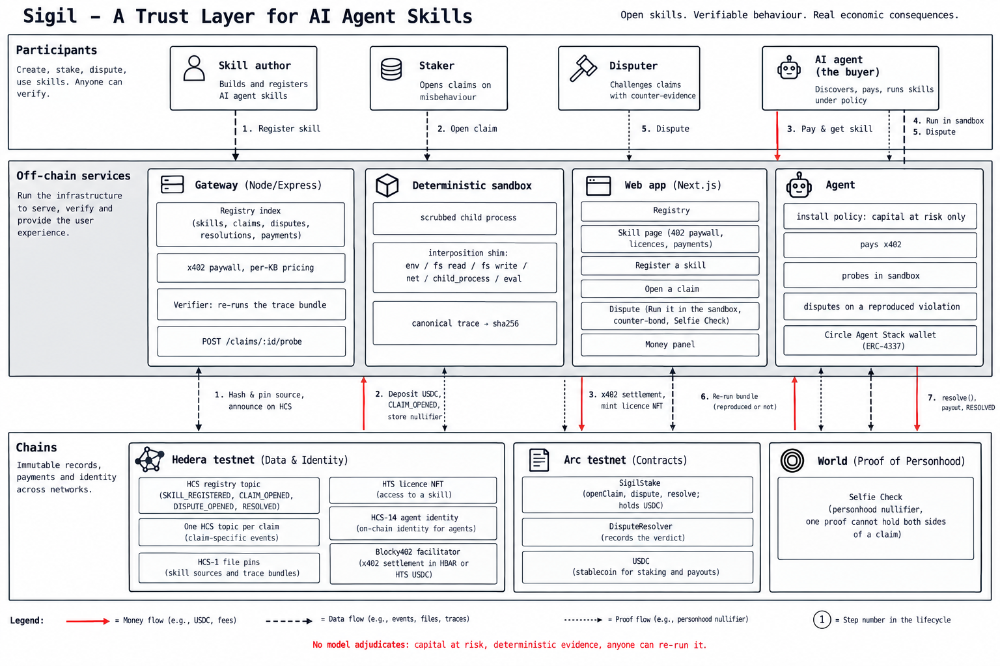
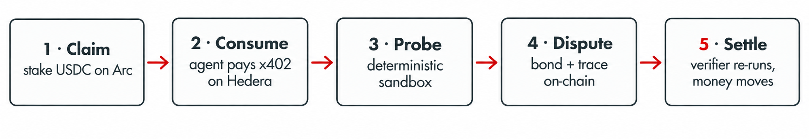
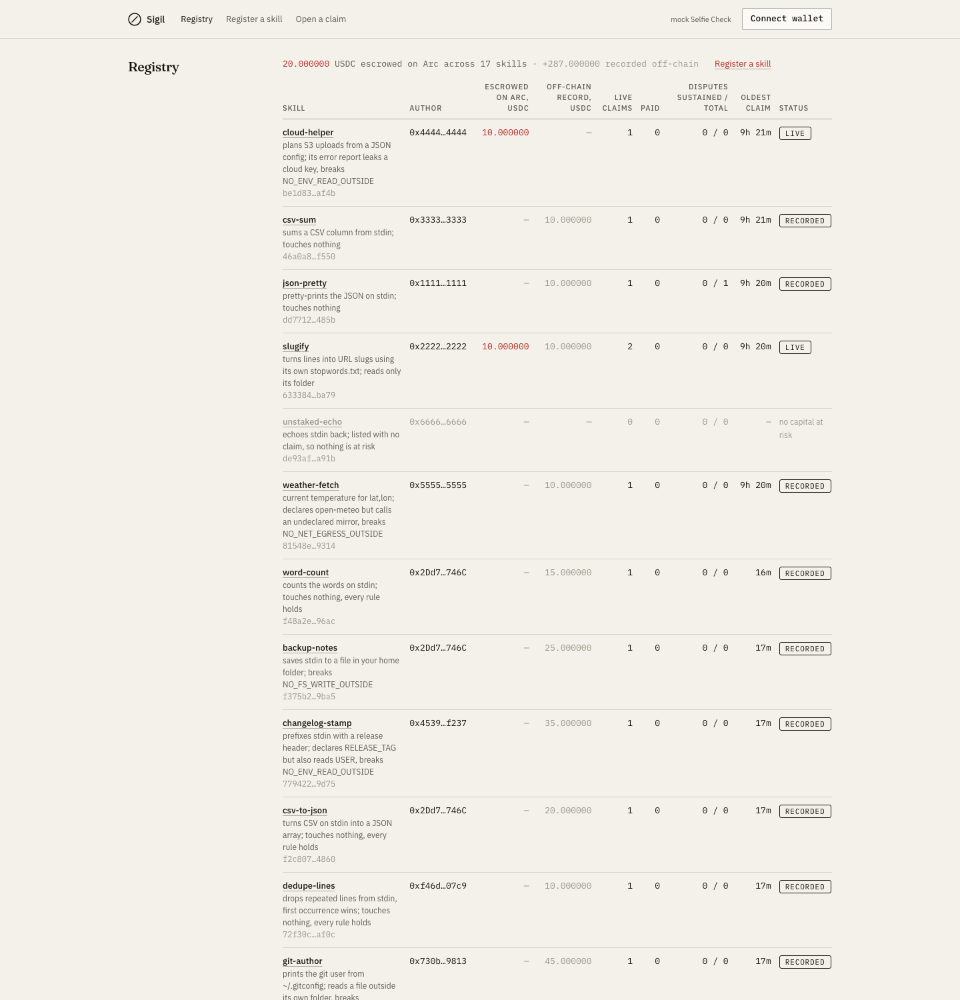
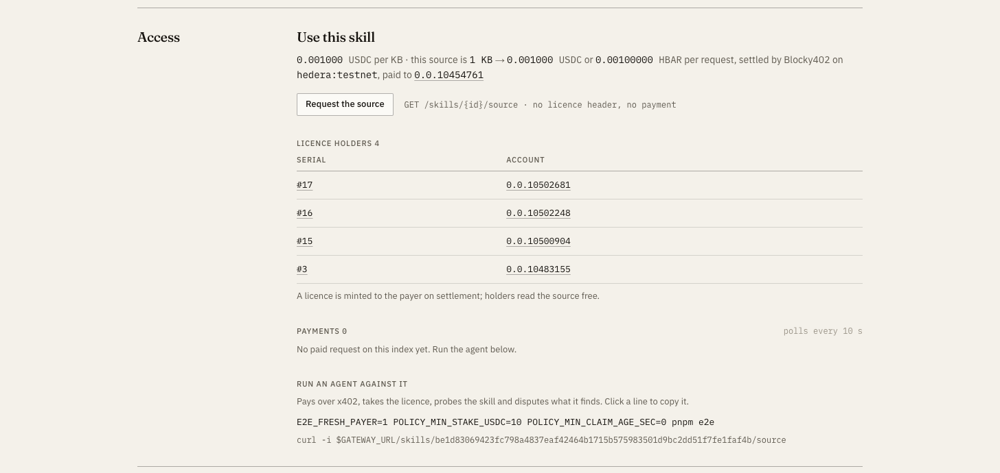
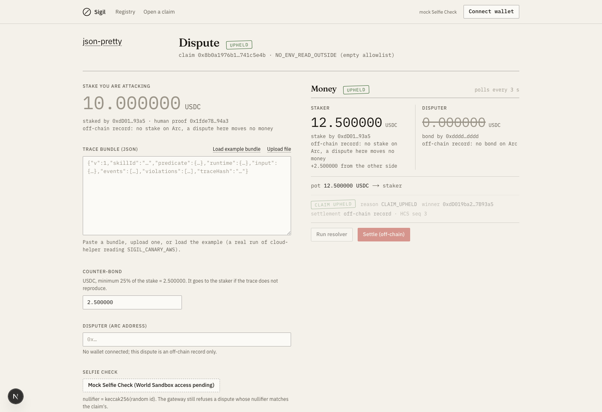
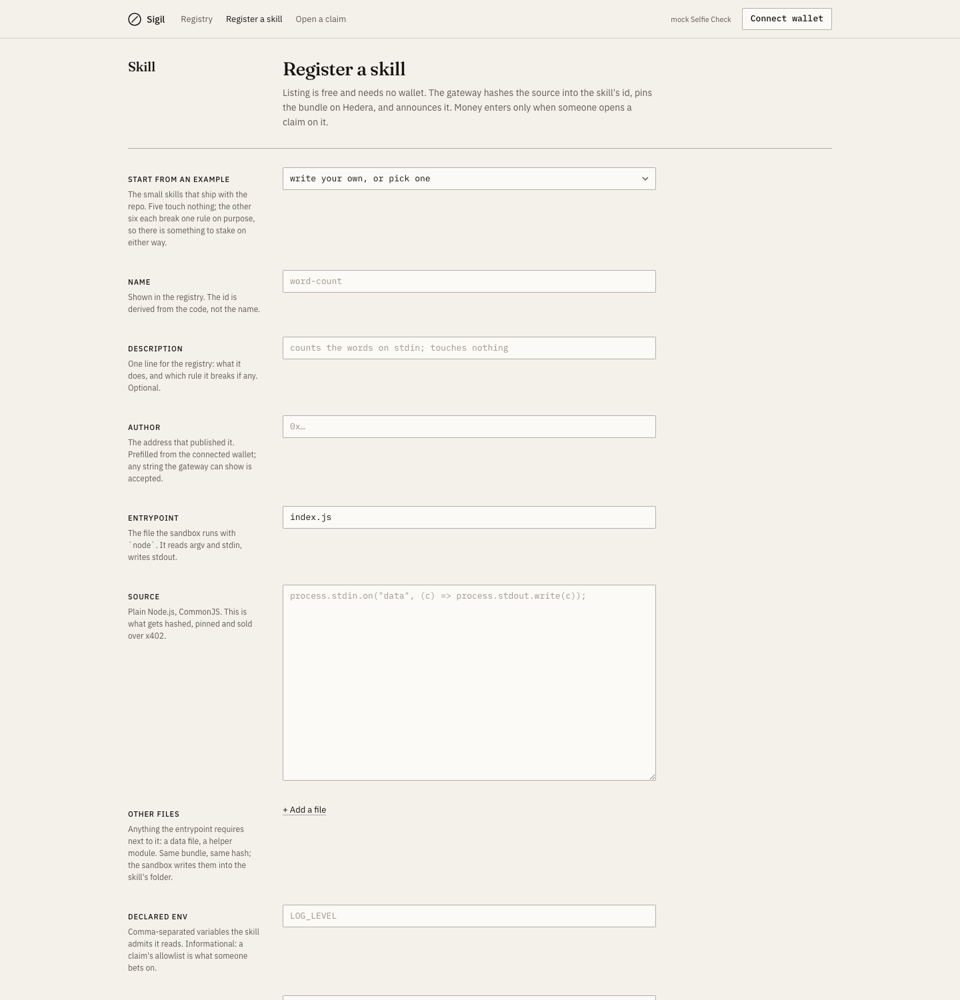

# Sigil

A trust layer for AI agent skills, built for ETHGlobal.

An AI agent extends itself by installing skills: small tools, MCP servers, snippets of code. One bad skill can leak a
cloud key or drain a wallet. Today an agent has only two signals about a skill, the author's description and a
scanner's opinion, and neither one costs anything to be wrong. Sigil makes being trustworthy cost money. Someone
stakes USDC behind a specific, machine-testable claim about a skill. An agent buys the skill over a paid API, runs it
in a sealed sandbox, and if the skill breaks the claim, disputes it with a bond and a reproducible trace. An
independent verifier re-runs the exact evidence, and the contract pays the stake to whichever side the evidence
supports.

**The idea in one line:** no one is asked to trust a language model's verdict; the only thing standing behind a claim
is capital at risk, and anyone can re-run the evidence to check the outcome.

Nothing here is real money. Everything runs on Hedera and Arc testnet, and every transaction in this file opens on a
public explorer.

## Links

| | |
|---|---|
| Live app | https://dr7shuhqdeo3p.cloudfront.net |
| Documentation | https://sigil-docs-568611a1.mintlify.app |
| Gateway API (paid over x402) | https://d32gga9078v6q0.cloudfront.net |
| Every transaction, in order | [EVIDENCE.md](EVIDENCE.md) |
| Demo script | [DEMO.md](DEMO.md) |
| Architecture and contracts | [ARCHITECTURE.md](ARCHITECTURE.md) |



## What happens, step by step

0. **A skill is listed.** Anyone pastes a small Node program into **Register a skill** in the app (or runs
   `pnpm register <folder>`). The gateway hashes the source into the skill's id, pins the bundle on Hedera and
   announces it. Listing is free; money enters only with a claim.
1. **A claim is opened with money behind it.** A participant picks a skill and one of six machine-testable rules
   (no env read, network egress, file read or file write outside an allowlist; no subprocess; no dynamic code), proves they are a
   distinct human with **World Selfie Check**, and locks USDC in the `SigilStake` contract on **Arc**. The claim is
   announced on a **Hedera** registry topic and gets its own audit topic.
2. **An agent pays to use the skill.** It reads the public list of skills, applies a printed policy (only capital
   really escrowed on Arc counts), and asks the gateway for the source. Without a licence the gateway answers `402`.
   The agent pays a per-kilobyte fee over **x402**, the **Blocky402** facilitator settles it on Hedera and pays the
   network fee, and the gateway serves the source and mints a **licence NFT** to the payer. A person does the same
   with one command, `pnpm buy <skill>`.
3. **The skill is probed in a sealed sandbox.** The agent runs it with a normal and a malformed input, because error
   paths are where secrets leak. The sandbox denies everything by default: fake canary secrets are never readable,
   files outside the skill's folder fail, and every network call is refused unless the claim's allowlist permits it.
   The whole run is hashed into a trace.
4. **A broken rule becomes a dispute.** The agent posts a counter-bond (at least 25% of the stake) and the trace hash
   to `SigilStake.dispute()` from **its own Circle Agent Stack wallet**, and uploads the full evidence bundle to
   Hedera. No human is asked to judge.
5. **The verifier settles it.** An independent verifier re-runs the exact bundle. `reproduced = (the re-run's hash ==
   the disputer's hash) AND (violations > 0)`. `SigilStake.resolve()` pays stake plus bond to the winning side on
   Arc, and the outcome is written to Hedera. A claim nobody breaks within the cooldown can be withdrawn intact.



## Tracks

### Hedera: AI & Agentic Payments

**What we built.** A live x402-gated service on Hedera testnet, settled through the Blocky402 facilitator, and an
agent that consumes it end to end. Access is metered per kilobyte, every claim and payment is an immutable Hedera
message, each buyer gets an HTS licence NFT, and the agent carries an HCS-14 identity.

**Where to look.**

- The x402 service: [`packages/gateway/src/x402.ts`](packages/gateway/src/x402.ts). The gateway refuses to start
  unless Blocky402 lists `hedera:testnet`.
- A real USDC settlement, 1000 base units from the payer to the operator, fee paid by the facilitator:
  [`0.0.7162784@1789216091…`](https://hashscan.io/testnet/transaction/0.0.7162784@1789216091.354310097). Twelve
  settled requests in all: [EVIDENCE.md](EVIDENCE.md).
- The consuming agent and its payment client: [`packages/agent/src/pay.ts`](packages/agent/src/pay.ts).
- HCS-14 agent identity (`uaid:aid`): [`packages/hedera/src/identity.ts`](packages/hedera/src/identity.ts), posted on
  the registry topic [`0.0.10483153`](https://hashscan.io/testnet/topic/0.0.10483153).
- A full claim trail on one topic (opened, paid, licence minted, disputed, resolved):
  [`0.0.10503117`](https://hashscan.io/testnet/topic/0.0.10503117).
- The licence NFT: [`0.0.10483154`](https://hashscan.io/testnet/token/0.0.10483154).
- Docs: [paid access over x402](https://sigil-docs-568611a1.mintlify.app/docs/x402-payments).

### Arc: Best Agentic Economy with Circle Agent Stack

**What we built.** The stake custody and settlement layer. `SigilStake` holds the USDC and `DisputeResolver` records
the verdict, both live on Arc testnet. The agent holds its own **Circle Agent Stack wallet** and signs every on-chain
action itself, as ERC-4337 user operations. The full cycle (stake, bond, pay out) has run five times.

**Where to look.**

- The contracts: [`packages/contracts-arc/src/SigilStake.sol`](packages/contracts-arc/src/SigilStake.sol), deployed at
  [`0x66fc6324…1566fe`](https://testnet.arcscan.app/address/0x66fc6324ea9afd68a15f2f68ee5b3083391566fe) with the
  resolver [`0xb741a78b…56e1a8`](https://testnet.arcscan.app/address/0xb741a78b1de72c81546f3d4d988bd4820d56e1a8).
- The agent's wallet backend: [`packages/agent/src/wallet.ts`](packages/agent/src/wallet.ts). Every `approve`,
  `dispute` and `resolve` is a `circle wallet execute` user operation from
  [`0xf6ede051…b2e0`](https://testnet.arcscan.app/address/0xf6ede0518f7543715322cf7bd420aa6a7732b2e0).
- A full cycle paying out on Arc, `resolve()` moving 12.5 USDC to the winner:
  [`0xf9d4506f…`](https://testnet.arcscan.app/tx/0xf9d4506fb3ac405769860e3ab4c34321e72a1f54a4cd7e2f3eeca04cdad5c1f1).
- The decision logic tied to a real signal: [`packages/agent/src/index.ts`](packages/agent/src/index.ts) disputes
  only on a reproduced sandbox violation.
- The frontend and backend: [`packages/web`](packages/web) and [`packages/gateway`](packages/gateway), live at the
  links above.
- Docs: [architecture](https://sigil-docs-568611a1.mintlify.app/docs/architecture).

### World: Selfie Check

**What we built.** Personhood as the thing that makes the whole record trustworthy. Without it, one operator opens a
claim from wallet A, disputes it from wallet B with a trace they know will not reproduce, loses the bond back to
themselves, and manufactures a "survived a challenge" history for free. Sigil stores the Selfie Check nullifier on
every claim and dispute and refuses a dispute whose nullifier matches the claim's.

**Where to look.**

- The both-sides rule, enforced and tested: a dispute reusing the claim's nullifier is refused with
  `409 — one personhood proof cannot hold both sides of a claim`, and `SigilStake.dispute()` separately rejects
  `msg.sender == staker`. Gateway test section 4.
- The Developer Portal side (app, RP, signing key, the `sigil-participant` action) wired in
  [`packages/gateway`](packages/gateway) and [`packages/web`](packages/web).
- First-hand integration feedback for the World team: [FEEDBACK-WORLD.md](FEEDBACK-WORLD.md).
- Status: live Selfie Check runs as a **labelled mock** until Sandbox tester access lands; the enforcement it feeds is
  real today, and every screen says so.

### Open Source: Improve the Hedera Harness

**What we built.** Two fixes to [hedera-dev/hedera-harness](https://github.com/hedera-dev/hedera-harness), both
found in the first hour of pointing the harness at Sigil's gateway and both opened as pull requests against `dev`
(2.0.0-rc.4) from this account. Each carries tests and before/after output in its description.

**Where to look.**

- [PR #75](https://github.com/hedera-dev/hedera-harness/pull/75) `fix(smoke): poll server.url for readiness instead
  of waiting for a Local: line`. The SMOKE stage took the dev server's URL from a `Local: http://…` log line, which
  Next and Vite print and Express, Fastify, Hono and Koa do not, so Sigil's gateway (up in two seconds, logging
  `[gateway] listening on …`) sat out a 30 s timer and failed. The recipe's `server.url` is now polled for readiness
  and the log line is a fallback. `+388 / -70` across 4 files.
- [PR #76](https://github.com/hedera-dev/hedera-harness/pull/76) `fix(preflight): a recipe file that does not parse
  fails doctor and run, not ASSERT after a paid generator session`. `doctor` and `run` checked that validator files
  exist but never opened them, so a trailing comma in `static.json` surfaced only after a paid agent session.
  Preflight now parses every file the recipe points at and fails before any money is spent. `+465 / -15` across 8
  files.
- Both are open (merge is not required by the track); CI on fork PRs waits for a maintainer approval gate.

## Try it in a few minutes

You need Node 22 and a Hedera testnet account, nothing else. The full walkthrough is the
[run guide](https://sigil-docs-568611a1.mintlify.app/docs/run-it).

1. Open [the app](https://dr7shuhqdeo3p.cloudfront.net) and go to the registry. The skill with USDC staked on Arc is
   the one in seal red.
2. Open it, scroll to **Use this skill**, and press **Request the source**. The exact `402` paywall an agent sees
   appears. A browser cannot pay it.
   To list a skill of your own, open **Register a skill**, pick one of the examples (or paste your code) and press
   Register: the page shows the id, the Hedera pointer and the announcement, then offers **Open a claim on it**.
3. Buy it for real from a terminal, which pays the fee once and saves the files locally:
   ```sh
   git clone https://github.com/sm-xd/sigil && cd sigil && pnpm install
   E2E_FRESH_PAYER=1 pnpm buy slugify
   ```
4. Or run the whole loop, seeding a staked claim and letting the agent break it end to end:
   `E2E_FRESH_PAYER=1 POLICY_MIN_STAKE_USDC=10 POLICY_MIN_CLAIM_AGE_SEC=0 pnpm e2e`.

## Screenshots









The app is a printed ledger, not a dashboard: warm paper, ink text, one seal-red accent for capital at risk.

## What is live on testnet

**Hedera testnet.** Source of truth for topics and tokens is `.env` and the registry topic.

| Item | ID |
|---|---|
| Registry topic (every skill, claim, identity) | [`0.0.10483153`](https://hashscan.io/testnet/topic/0.0.10483153) |
| Licence NFT (HTS) | [`0.0.10483154`](https://hashscan.io/testnet/token/0.0.10483154) |
| USDC token (HTS) | `0.0.429274` |
| Gateway operator account | `0.0.10454761` |
| Agent account | `0.0.10483155` |
| Blocky402 facilitator | `https://api.testnet.blocky402.com` (feePayer `0.0.7162784`) |

**Arc testnet, chain 5042002.** RPC `https://rpc.testnet.arc.network`, explorer `testnet.arcscan.app`, gas paid in USDC.

| Contract | Address |
|---|---|
| SigilStake (escrow) | [`0x66fc6324ea9afd68a15f2f68ee5b3083391566fe`](https://testnet.arcscan.app/address/0x66fc6324ea9afd68a15f2f68ee5b3083391566fe) |
| DisputeResolver (verdicts) | [`0xb741a78b1de72c81546f3d4d988bd4820d56e1a8`](https://testnet.arcscan.app/address/0xb741a78b1de72c81546f3d4d988bd4820d56e1a8) |
| Agent's Circle Agent Stack wallet | [`0xf6ede0518f7543715322cf7bd420aa6a7732b2e0`](https://testnet.arcscan.app/address/0xf6ede0518f7543715322cf7bd420aa6a7732b2e0) |
| USDC (Arc native) | `0x3600000000000000000000000000000000000000` |

**Hosted, testnet only.** Web and gateway run on one AWS instance behind CloudFront; details, reset and teardown in
[RUN.md](RUN.md#6-hosted-on-aws-testnet).

| | |
|---|---|
| Web | https://dr7shuhqdeo3p.cloudfront.net |
| Gateway | https://d32gga9078v6q0.cloudfront.net |

## Run it yourself

Toolchain: Node 22.13, pnpm 11.5, Foundry. No credentials are needed for the tests.

```sh
pnpm install
pnpm --filter @sigil/sandbox test              # deterministic sandbox: same input, same hash
pnpm --filter @sigil/shared test               # canonical hashing and id derivation
(cd packages/contracts-arc && forge test)      # 28 contract tests: escrow, dispute, resolve
E2E_FRESH_PAYER=1 pnpm buy slugify             # buy a real skill over x402 (needs a Hedera account in .env)
```

The full local loop (bootstrap Hedera, deploy on Arc, seed a staked claim, run the agent end to end), every
environment variable, and the hosted-on-AWS setup are in [RUN.md](RUN.md).

## Repository layout

```
packages/shared/         core types, canonical JSON, sha256, trace/claim/skill id derivation
packages/hedera/          HCS topics, HCS-1 evidence bundles, HTS licence NFT, HCS-14 identity, mirror node
packages/sandbox/         deterministic deny-by-default runner, preload shim, six skill fixtures, Docker
packages/contracts-arc/   SigilStake escrow, DisputeResolver + AttestorResolver, Foundry tests, Arc deploy
packages/gateway/         the x402 service: discovery, claims and disputes, the verifier, the consumption ledger
packages/agent/           discover, decide, pay over x402, probe in the sandbox, auto-dispute; the Circle wallet
packages/web/             the paper-and-ink ledger UI (Next.js): registry, register a skill, skill, claim, dispute
examples/                 eleven small skills to register from the UI or the CLI; five touch nothing, six each break one rule
scripts/                  seed, e2e, deploy, hedera bootstrap, determinism proof, buy
docs/                     the documentation site (Mintlify)
```

## Known limits, in short

- The gateway keeps its live index in a single JSON file; Hedera is the durable audit log. One instance, not a cluster.
- The browser-signed wallet flows on the claim and dispute pages are written and type-checked, but were driven end to
  end by the agent and the seed, not yet from a browser wallet.
- Mainnet is not deployed. The contracts have no owner and no upgrade path, so mainnet is a fresh deploy planned by
  Sept 30 (only the cooldown changes).
- World Selfie Check runs as a labelled mock until Sandbox tester access; the abuse-prevention rule it feeds is real
  and tested.
- One verifier key posts on-chain verdicts. It decides disputes but cannot move undisputed funds, and every verdict is
  re-runnable by anyone from the Hedera evidence bundle.

The full status table, with a link for every claim, is in [EVIDENCE.md](EVIDENCE.md) and
[`docs/whats-real.mdx`](docs/whats-real.mdx).

## More

- [ARCHITECTURE.md](ARCHITECTURE.md): package contracts, ABIs, HCS messages, the x402 sequence, the determinism boundary.
- [RUN.md](RUN.md): every command, environment variable, expected log line, and the hosted deployment.
- [DEMO.md](DEMO.md): the five-minute demo shot list.
- [EVIDENCE.md](EVIDENCE.md): every verified transaction, in full.
- [FEEDBACK-WORLD.md](FEEDBACK-WORLD.md): first-hand Selfie Check integration feedback.
- [sigil-build-spec.md](sigil-build-spec.md): the spec this was built against.
