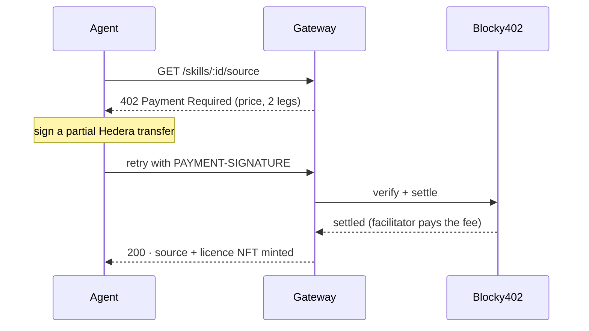

Skills are not free to read. The gateway sells a skill's source over **x402**, the pay-per-request standard, and the payment settles on **Hedera** through the **Blocky402** facilitator. Every payment mints a licence NFT, so the same account never pays twice.

## The flow, step by step

<Steps>
  <Step title="Ask for the source">
    The agent calls `GET /skills/:id/source` with a header saying which Hedera account it is. If that account already holds the skill's licence NFT, it gets the source for free.
  </Step>
  <Step title="Get the price (402)">
    Otherwise the gateway replies **`402 Payment Required`** with a `PAYMENT-REQUIRED` header. The price is metered per kilobyte: `ceil(bytes / 1024) × 0.001 USDC`. It is offered as two legs — pay in **HTS USDC** (`0.0.429274`) or in **HBAR**.
  </Step>
  <Step title="Sign and retry">
    The agent signs a partly-signed Hedera transfer (its own key only; the network fee is left to the facilitator) and retries with a `PAYMENT-SIGNATURE` header.
  </Step>
  <Step title="Blocky402 settles it">
    The gateway hands the signed transfer to Blocky402. The facilitator co-signs as fee payer, submits it, and pays the network fee itself.
  </Step>
  <Step title="Source, licence, and receipt">
    The gateway returns `200` with the source and a `PAYMENT-RESPONSE` header carrying the Hedera transaction ID. In the background it writes `PAYMENT_SETTLED` to Hedera, mints the licence NFT to the payer, and writes `LICENSE_MINTED`.
  </Step>
</Steps>

## This actually happened — open the proof

These are real testnet settlements. Click any of them to see the token transfer on HashScan.

| When | What happened | Transaction |
|---|---|---|
| First USDC payment | 0.001 USDC moved from the payer to the gateway operator; fee paid by Blocky402 | [0.0.7162784@1789216091…](https://hashscan.io/testnet/transaction/0.0.7162784@1789216091.354310097) |
| Through the hosted gateway | A one-off paid request for a skill, over CloudFront to the cloud server | [0.0.7162784@1789231923…](https://hashscan.io/testnet/transaction/0.0.7162784@1789231923.585787669) |
| `pnpm buy` a skill | Paid, took the licence, saved the files locally | [0.0.7162784@1789235473…](https://hashscan.io/testnet/transaction/0.0.7162784@1789235473.282977279) |
| Full agent run | Paid, then disputed and broke the claim in the same run | [0.0.7162784@1789242115…](https://hashscan.io/testnet/transaction/0.0.7162784@1789242115.597039843) |

<Note>
Twelve real paid requests have settled in total — some in HBAR, some in HTS USDC. The full list, with the exact `token_transfers` and fees, is in the repo's [README](https://github.com/sm-xd/sigil#the-x402-payment-flow).
</Note>

## Where you can see it in the UI

<Frame caption="The 'Use this skill' section: the live paywall, the licence holders, and the payments ledger.">
  
</Frame>

On any skill page, press **Request the source** to see the exact `402` an agent gets. The **Licence holders** and **Payments** ledgers below it are read live from Hedera, so a real payment shows up there within seconds.
